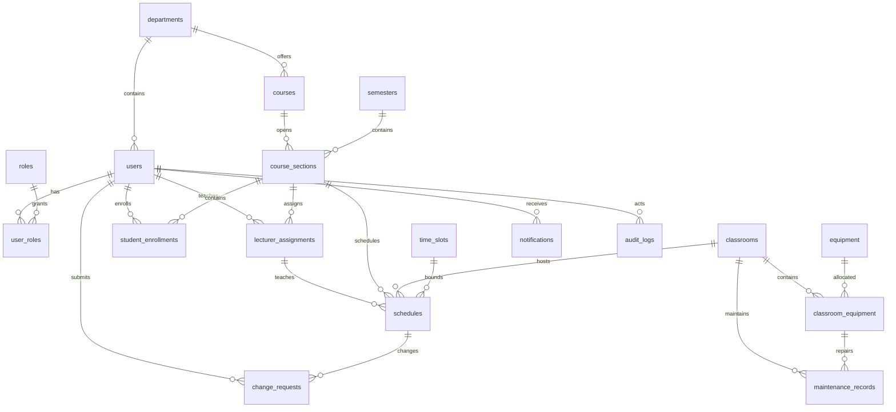

# MySQL và JDBC của UniSchedule

Ứng dụng chạy bằng JDBC thuần với MySQL 8.4. Các repository mock chỉ nằm trong `src/test`; ứng dụng không chuyển sang mock khi mất kết nối. Dữ liệu mẫu được nạp một lần vào database bằng script seed và có thể sửa, lưu, đọc lại sau khi khởi động lại.

## Chạy bản đã cấu hình trên máy này

```powershell
./scripts/run-local.ps1
# Kiểm tra đăng nhập bốn tài khoản, không mở giao diện:
./scripts/run-local.ps1 -Smoke
# Dừng riêng MySQL của dự án:
./scripts/stop-local-db.ps1
```

MySQL riêng của dự án nằm trong `.local/mysql-test`, chỉ lắng nghe `127.0.0.1:3307`. Database ứng dụng là `unischedule`; database kiểm thử là `unischedule_test`. Dịch vụ tại cổng 3306 không bị thay đổi. `.local/` chứa dữ liệu, runtime và cấu hình mật khẩu cục bộ; đã loại khỏi Git. Giữ thư mục này nếu muốn giữ dữ liệu đã nhập. Không chạy `mvn clean` để xóa database: database nằm ngoài `target`.

Tài khoản ứng dụng seed: `admin`, `daotao`, `giangvien`, `sinhvien`, mật khẩu ban đầu `123456`. Đây là tài khoản đăng nhập ứng dụng, khác tài khoản kết nối MySQL `unischedule_app`. Mật khẩu kết nối được sinh ngẫu nhiên và không nằm trong mã nguồn.

## Cấu hình trên máy khác

1. Cài MySQL 8.0.16 trở lên hoặc 8.4. Dùng tài khoản quản trị chạy `src/main/resources/db/00_create_database.sql`.
2. Tạo tài khoản MySQL riêng. Chạy bằng MySQL client, thay mật khẩu ví dụ:

```sql
CREATE USER 'unischedule_app'@'localhost' IDENTIFIED BY 'REPLACE_WITH_A_RANDOM_PASSWORD';
GRANT SELECT, INSERT, UPDATE, DELETE ON unischedule.* TO 'unischedule_app'@'localhost';
```

3. Với tài khoản quản trị, chạy các file `01` đến `07` lần lượt trong database `unischedule`, sau đó `09` đến `12` nếu cần seed. `08_create_procedures.sql` là các báo cáo tùy chọn, dùng MySQL client hỗ trợ `DELIMITER`. Không chạy lại seed trên database đã có dữ liệu.
4. Cấu hình biến môi trường trong terminal dùng để chạy ứng dụng:

```powershell
$env:UNISCHEDULE_DB_URL='jdbc:mysql://localhost:3306/unischedule?connectionTimeZone=UTC&forceConnectionTimeZoneToSession=true&connectTimeout=5000&socketTimeout=15000'
$env:UNISCHEDULE_DB_USER='unischedule_app'
$env:UNISCHEDULE_DB_PASSWORD=Read-Host 'Mật khẩu MySQL' -MaskInput
mvn clean test
mvn exec:java
```

Có thể dùng tài khoản migration có quyền `CREATE`, `REFERENCES`, `INDEX`, `CREATE VIEW` để chạy `mvn compile exec:java -Dexec.mainClass=vn.edu.donga.unischedule.config.DatabaseSetup -Dexec.args=--seed` trên database rỗng đã được tạo. Lệnh từ chối database có bảng, không xóa dữ liệu tự động. MySQL DDL tự commit; nếu migration lỗi giữa chừng, kiểm tra lỗi và sửa database phát triển trước khi chạy lại. Không dùng tài khoản migration làm tài khoản chạy ứng dụng.

## Mô hình dữ liệu

| Nhóm | Các bảng và quan hệ chính |
| --- | --- |
| Danh tính | `roles`, `users`, `user_roles`: người dùng gắn với vai trò qua khóa ghép. `departments` liên kết người dùng và môn học. |
| Đào tạo | `semesters`, `time_slots`, `courses`, `course_sections`: lớp thuộc môn và học kỳ. |
| Tham gia lớp | `lecturer_assignments`, `student_enrollments`: phân công người dạy và đăng ký sinh viên; mỗi cặp lớp/người dùng là duy nhất. |
| Tài nguyên | `classrooms`, `equipment`, `classroom_equipment`: thiết bị được phân bổ theo phòng, có số lượng và tình trạng riêng. |
| Lịch | `schedules`: tham chiếu lớp, phân công đúng lớp, phòng, ca bắt đầu/kết thúc và khoảng ngày. |
| Xử lý công việc | `change_requests`, `notifications`, `audit_logs`, `maintenance_records`. |

Tổng cộng **18 bảng** InnoDB, `utf8mb4_unicode_ci`, khóa chính `BIGINT UNSIGNED`. Tất cả dữ liệu ngày giờ phát sinh được ghi UTC. Avatar là `users.avatar_data MEDIUMBLOB`; mã giảng viên, mã sinh viên và mã lớp hành chính giữ các thuộc tính hiện có của model Java.



## Các quyết định triển khai

- Lưu lịch và duyệt yêu cầu dùng transaction JDBC, kiểm tra lại dữ liệu hiện tại trước khi ghi. Khóa hàng vai trò `ACADEMIC` được dùng làm khóa chung cho thao tác lịch, đăng ký và tài nguyên để ngăn hai phiên đồng thời vượt qua kiểm tra xung đột. Đây là lựa chọn đơn giản cho quy mô đồ án; sẽ cần chia nhỏ khóa nếu tải ghi lớn.
- Xung đột được tính từ lịch, không lưu một danh sách giả. Kiểm tra trùng phòng, **người giảng viên** và lớp khi ngày/ca/khoảng ngày giao nhau. Một ca đơn được phép. Xóa lịch chuyển sang `CANCELLED`.
- Sinh viên chỉ thấy lịch `PUBLISHED` của lớp có đăng ký `ACTIVE`; giảng viên chỉ thấy lịch theo phân công. Sĩ số tính từ đăng ký, cập nhật cùng transaction. Không nhập tay sĩ số. Màn hình lớp học phần có nút đăng ký/hủy học cho phòng đào tạo.
- Đổi phòng/đổi thời gian/mượn phòng ảnh hưởng lịch do `ACADEMIC` duyệt; mượn thiết bị/báo hỏng do `ADMIN` duyệt. Giữ enum Java `CHANGE_SCHEDULE` thay cho tên `CHANGE_TIME` trong tài liệu tham chiếu. Kiểm tra quyền ghi tại điểm thực thi JDBC, kể cả khi gọi ngoài UI.
- Đổi lịch áp dụng cho lịch tuần trong khoảng ngày đang có; ngày đề nghị xác định thứ mới, số ca được giữ nguyên. Mượn phòng tạo lịch một ngày, cần chọn lịch lớp thuộc giảng viên gửi yêu cầu. Mượn thiết bị là đặt số lượng tại phòng/ngày/ca; yêu cầu đã duyệt được tính vào số lượng đã đặt. Tên thiết bị phải khớp thiết bị trong phòng.
- Không cho chuyển phòng sang bảo trì nếu còn lịch hiện tại/tương lai; cần chuyển/hủy lịch trước. Thay giảng viên hoặc học kỳ của lớp có lịch hoạt động cũng yêu cầu xử lý lịch trước. Các bản ghi bảo trì được lưu và dùng khi tìm phòng.
- Duyệt/từ chối yêu cầu, đổi lịch, thông báo và audit cùng commit hoặc rollback. Lỗi không thay đổi trạng thái yêu cầu trên UI.
- Mật khẩu dùng PBKDF2-HMAC-SHA256, 600.000 vòng, salt ngẫu nhiên 16 byte và so sánh constant-time; không dùng mật khẩu văn bản thuần trong database. Đây là lựa chọn JDK thuần thay cho BCrypt/Argon2 đề xuất trong tài liệu tham chiếu.
- Ảnh PNG/JPEG tối đa 5 MB, kiểm tra định dạng thực và kích thước tối đa 20 triệu pixel, cắt giữa thành PNG 512×512 trước khi lưu. Có đổi/xóa ảnh; avatar hồ sơ và thanh đầu trang cập nhật sau khi lưu thành công. Không lưu đường dẫn máy người dùng vào database.
- Các mock nằm trong `src/test` để kiểm thử UI độc lập; không đóng gói vào ứng dụng. Không cung cấp chế độ mock trong bản chạy theo yêu cầu thay toàn bộ dữ liệu giả.

## Kiểm chứng

`mvn test` chạy kiểm thử model/controller/kiến trúc, ảnh và render UI. `JdbcIntegrationTest` chỉ bật khi `UNISCHEDULE_DB_URL` trỏ tới database tên `unischedule_test`; database này cần được khởi tạo và seed trước. Chỉ dùng database thử nghiệm vì kiểm thử có thao tác ghi. Chạy trên seed mới để đối chiếu đúng số lượng ban đầu.

Chạy `src/main/resources/db/90_verify_database.sql` để kiểm tra bảng, vai trò, sai lệch sĩ số và xung đột lịch. Hai truy vấn cuối phải không có dòng nào sau seed.

Trên máy đã có MySQL riêng, `./scripts/test-local.ps1` tạo lại **chỉ database `unischedule_test`**, nạp seed và chạy toàn bộ kiểm thử, bao gồm JDBC và render màn hình của bốn vai trò. Lệnh này xóa dữ liệu test cũ; không thay đổi database ứng dụng `unischedule`. Ảnh kiểm chứng JDBC nằm trong `target/jdbc-previews`.

Các view: `vw_schedule_details`, `vw_student_timetable`, `vw_lecturer_timetable`, `vw_room_utilization`. Các procedure báo cáo là tùy chọn, không cần cho CRUD qua JDBC.

### Kết quả kiểm thử đã thực hiện

- Build sạch: **25 kiểm thử đạt, 0 lỗi, 0 bỏ qua**, gồm 8 kiểm thử tích hợp trên MySQL 8.4.6.
- Schema ứng dụng có đủ 18 bảng InnoDB/utf8mb4, 4 vai trò, 6 giảng viên và 20 sinh viên; seed không có xung đột lịch hoặc sai lệch sĩ số.
- Đã kiểm chứng ảnh hồ sơ và mật khẩu tồn tại qua kết nối mới, đăng ký/hủy học, thông báo đã đọc, thiết bị, bảo trì, xóa mềm lịch và rollback yêu cầu.
- Hai phiên đặt cùng phòng/ca đồng thời: chỉ một phiên lưu thành công.
- Đã render dashboard và hồ sơ bằng JDBC cho đủ bốn vai trò; ảnh trong `target/jdbc-previews`.
