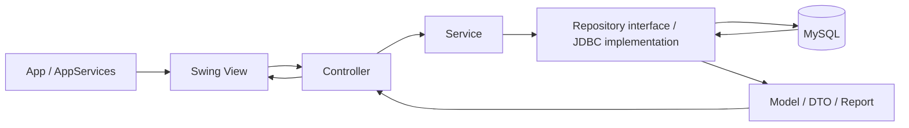
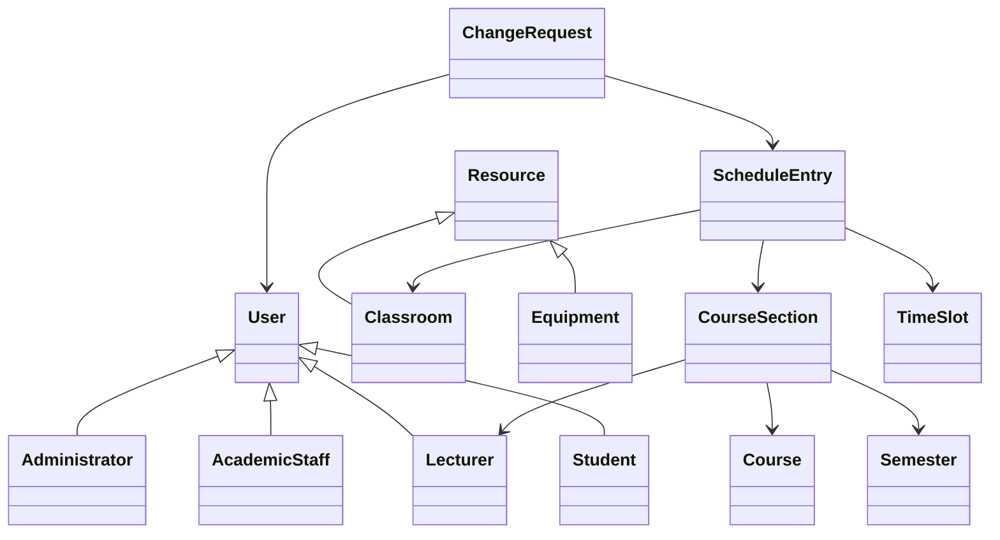
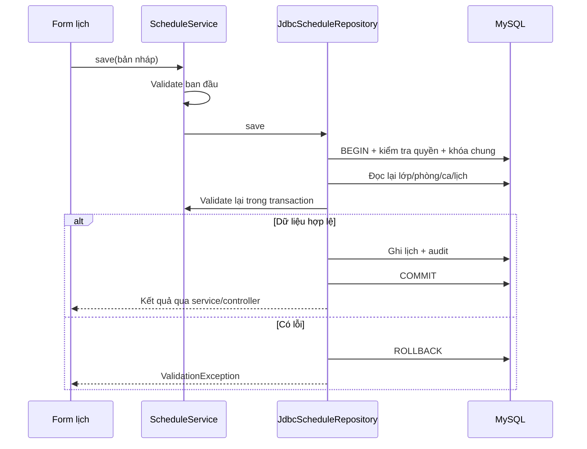

# UniSchedule — Toàn bộ luồng logic, công nghệ, thuật toán và hỏi đáp Java

**Tài liệu học, đọc mã nguồn và bảo vệ đồ án — cập nhật theo mã nguồn ngày 13/09/2026.**

Tài liệu này tổng hợp kiến thức Java liên quan trực tiếp đến UniSchedule. Các mục “đang có” mô tả implementation hiện tại; các mục “có thể cải tiến” là hướng phát triển, không phải chức năng đã triển khai. Mã giả được ghi rõ để phân biệt với mã có thể chạy. Mật khẩu kết nối MySQL cục bộ không được chép vào tài liệu.

## Mục lục

1. [Giới thiệu và cách thuyết trình ngắn](#overview)
2. [Công nghệ và vai trò](#technologies)
3. [Kiến trúc và cấu trúc thư mục](#architecture)
4. [Phân quyền](#roles)
5. [Mô hình đối tượng và cơ sở dữ liệu](#data-model)
6. [Toàn bộ luồng nghiệp vụ](#flows)
7. [Thuật toán, công thức và độ phức tạp](#algorithms)
8. [JDBC, transaction và xử lý đồng thời](#transactions)
9. [Giao diện Swing, luồng và xử lý lỗi](#swing)
10. [Bảo mật và xử lý file](#security)
11. [Chạy, cấu hình và kiểm thử](#run-tests)
12. [80 câu hỏi–trả lời trọng tâm Java và đồ án](#questions)
13. [Kịch bản demo và câu hỏi tình huống](#demo)
14. [Giới hạn hiện tại và hướng cải tiến](#limitations)
15. [Bản đồ mã nguồn cần mở khi bảo vệ](#source-map)

<a id="overview"></a>
## 1. Giới thiệu và cách thuyết trình ngắn

UniSchedule là ứng dụng desktop quản lý thời khóa biểu và tài nguyên phòng học. Người dùng đăng nhập theo vai trò, quản lý lớp học phần, phân công giảng viên, đăng ký sinh viên, lập lịch, tra cứu phòng, gửi/duyệt yêu cầu, cập nhật hồ sơ và xem báo cáo.

**Câu giới thiệu khoảng một phút:**

> Em xây dựng UniSchedule bằng Java, giao diện Swing, truy cập dữ liệu bằng JDBC và lưu dữ liệu trong MySQL. Ứng dụng chia thành View, Controller, Service, Repository và các model. Chức năng trọng tâm là quản lý thời khóa biểu có kiểm tra trùng phòng, trùng giảng viên và trùng lớp học phần. Các thao tác nhiều bước như duyệt yêu cầu hay đăng ký học được thực hiện trong transaction để đảm bảo tính nhất quán. Ngoài ra hệ thống có mật khẩu băm, phân quyền, ảnh hồ sơ lưu trong database, thông báo, audit log và báo cáo thống kê theo khoảng ngày.

**Bốn nội dung nên nắm chắc nhất:**

- OOP và việc chia trách nhiệm giữa các lớp.
- JDBC, PreparedStatement, ánh xạ dữ liệu và quản lý connection.
- Điều kiện giao nhau của lịch và khóa chống đặt trùng đồng thời.
- Luồng từ sự kiện trên giao diện đến transaction trong MySQL rồi cập nhật lại giao diện.

<a id="technologies"></a>
## 2. Công nghệ và vai trò

Các phiên bản sau lấy từ `pom.xml` hoặc môi trường MySQL đã kiểm chứng của dự án, không phải tuyên bố về phiên bản mới nhất trên thị trường.

| Công nghệ | Dự án sử dụng | Giải thích khi bảo vệ |
| --- | --- | --- |
| Java | Biên dịch với `release=17` | Ngôn ngữ chính; dùng OOP, generic, collection, Stream, lambda, record, exception, API ngày giờ. |
| JDK/JVM | Máy phát triển có thể dùng JDK mới hơn 17 | JDK biên dịch; JVM thực thi bytecode. JDK đang chạy không đồng nghĩa với mức ngôn ngữ mục tiêu. |
| Swing | JFrame, JPanel, JTable, JDialog, SwingWorker | Giao diện desktop, lập trình hướng sự kiện. |
| AWT/Java2D | Layout, Graphics2D, BufferedImage | Bố cục, vẽ giao diện và chuẩn hóa ảnh hồ sơ. |
| FlatLaf | 3.5.4 | Look and Feel, làm giao diện Swing nhất quán. |
| FlatLaf Extras | 3.5.4 | Hỗ trợ hiển thị icon SVG. |
| Maven | `pom.xml` | Quản lý dependency, compile, test và chạy chương trình. |
| JDBC | API `java.sql` | Giao tiếp database bằng Connection, PreparedStatement, ResultSet. |
| MySQL Connector/J | 9.1.0 | Driver triển khai JDBC cho MySQL; phiên bản driver khác phiên bản server. |
| MySQL | Đã kiểm chứng 8.4.6 | Lưu trữ quan hệ, khóa ngoại, index, transaction InnoDB. |
| JUnit Jupiter | 5.11.4, scope test | Unit test, integration test và kiểm chứng render UI. |
| Java Cryptography | PBKDF2WithHmacSHA256 | Băm mật khẩu có salt và nhiều vòng lặp. |
| ImageIO | PNG/JPEG | Đọc ảnh, kiểm tra định dạng và ghi lại PNG. |
| NIO.2 | Path, Files | Đọc ảnh, ghi file CSV/HTML và xử lý file tạm. |

Không có Spring Boot, Hibernate/JPA, REST API, React, JavaFX, Redis hoặc hệ thống AI tự xếp lịch trong bản hiện tại. Dữ liệu runtime lấy từ MySQL; mock chỉ dùng trong test.

<a id="architecture"></a>
## 3. Kiến trúc và cấu trúc thư mục



| Tầng | Trách nhiệm thực tế | Ví dụ |
| --- | --- | --- |
| View | Hiển thị, nhận input, sự kiện, lựa chọn hàng, dialog lỗi/thành công | `TimetablePanel`, `ProfilePanel`, `ReportPanel`. |
| Controller | Chuyển input thành model nháp; điều phối; lọc và trình bày kết quả | `FormController`, `ScheduleController`, `ReportController`. |
| Service | Kiểm tra nghiệp vụ, gọi repository, tính thuật toán | `ConflictService`, `ScheduleService`, `ReportService`. |
| Repository | Đọc/ghi; JDBC mapper; một số kiểm tra quyền và nghiệp vụ trong transaction | `JdbcScheduleRepository`, `JdbcRequestRepository`. |
| Model | Mô tả thực thể và kết quả | `User`, `Classroom`, `ScheduleEntry`, `Report`. |
| Config | Cấu hình, khởi tạo database, giao diện | `DatabaseConfig`, `DatabaseSetup`, `ThemeConfig`. |
| Util/validation | Hàm dùng chung, băm mật khẩu, ảnh, xuất file, validation | `PasswordHasher`, `ProfileImages`, `ReportExport`, `Validator`. |

**Điểm phải nói đúng:** đây là MVC có bổ sung service/repository. Ranh giới Service–Repository chưa hoàn toàn thuần: các JDBC repository còn chứa kiểm tra quyền, khóa và điều phối nghiệp vụ; `JdbcScheduleRepository` gọi lại validation lịch. Có thể refactor transaction nghiệp vụ về service sau này. Không nên trình bày rằng “mọi nghiệp vụ đều nằm ở Service”.

```text
src/main/java/vn/edu/donga/unischedule/
├── App.java
├── config/
├── controller/
├── model/
├── repository/
│   └── jdbc/
├── service/
├── ui/
│   ├── frame/        # Cửa sổ chính, đăng nhập
│   ├── panel/        # Màn hình nghiệp vụ
│   ├── dialog/       # Form thêm/sửa/chi tiết
│   ├── component/    # Nút, thẻ số liệu, avatar
│   ├── model/        # Adapter dữ liệu JTable
│   └── renderer/     # Cách vẽ nhãn, badge, ô bảng
├── util/
└── validation/
src/main/resources/db/        # Schema, index, view, seed, SQL xác minh
src/test/java/                # Test và mock fixtures
scripts/                      # Chạy MySQL cục bộ, chạy app, kiểm thử
```

`ui.model.GenericTableModel` là model của JTable, không phải thực thể database. `AppServices` và `AppControllers` nối các dependency bằng constructor; không sử dụng DI container của Spring.

<a id="roles"></a>
## 4. Phân quyền

| Chức năng chính | ADMIN | ACADEMIC | LECTURER | STUDENT |
| --- | --- | --- | --- | --- |
| Quản lý người dùng | Có | Không | Không | Không |
| Ghi phòng, thiết bị, bảo trì | Có | Không | Không | Không |
| Ghi lớp, phân công, đăng ký học | Không | Có | Không | Không |
| Tạo/sửa/hủy lịch | Không | Có | Không | Không |
| Xem lịch | Toàn bộ theo tuần | Toàn bộ theo tuần | Lịch đã công bố theo phân công | Lịch đã công bố của lớp đã đăng ký |
| Gửi yêu cầu | Không qua luồng tạo của giảng viên | Không qua luồng tạo của giảng viên | Có | Không |
| Duyệt đổi lịch, đổi phòng, mượn phòng | Không | Có | Không | Không |
| Duyệt mượn thiết bị, báo hỏng | Có | Không | Không | Không |
| Báo cáo thống kê | Có | Có | Không | Không |
| Hồ sơ, ảnh, mật khẩu cá nhân | Có | Có | Có | Có |
| Tra cứu phòng; thông báo của mình | Có | Có | Có | Có |

`MainFrame` ẩn/hiện menu để phù hợp vai trò. Điểm ghi JDBC dùng `JdbcDatabase.require(...)` để kiểm tra tài khoản còn `ACTIVE` và có vai trò cần thiết trong database. Ẩn nút không thay thế kiểm tra quyền.

Database có `roles` và `user_roles` để biểu diễn nhiều vai trò. Model `User` hiện có một trường `Role`; giao diện và nhiều luồng vẫn xử lý theo một vai trò. Không khẳng định đã có đầy đủ chức năng chuyển/gộp nhiều vai trò trong một phiên.

<a id="data-model"></a>
## 5. Mô hình đối tượng và cơ sở dữ liệu

### 5.1. Kế thừa và liên kết đối tượng



- `User` và `Resource` là abstract class: thể hiện nhóm khái niệm chung, không khởi tạo trực tiếp.
- `Lecturer` có khoa/mã giảng viên; `Student` có mã sinh viên/lớp hành chính.
- `CourseSection` là lớp học phần của một môn trong học kỳ; khác lớp hành chính trong `Student.classCode`.
- `Equipment` có ID thiết bị và `placementId` của phân bổ vào phòng. Không nhầm hai ID khi sửa số lượng.
- Model dùng `Long` cho ID để có thể biểu diễn `null` trước khi insert.
- Nhiều entity so sánh `equals` theo class và ID không null. Hai object vừa đọc từ các query khác nhau có thể biểu diễn cùng một bản ghi.

### 5.2. 18 bảng

| STT | Bảng | Vai trò |
| --- | --- | --- |
| 1 | `roles` | Danh mục vai trò. |
| 2 | `departments` | Khoa. |
| 3 | `users` | Thông tin tài khoản, password hash, avatar. |
| 4 | `user_roles` | Quan hệ người dùng–vai trò, khóa ghép. |
| 5 | `semesters` | Học kỳ và khoảng ngày. |
| 6 | `time_slots` | Ca, giờ bắt đầu/kết thúc, thứ tự. |
| 7 | `courses` | Môn học, tín chỉ, khoa. |
| 8 | `course_sections` | Lớp học phần, sức chứa, sĩ số cache. |
| 9 | `lecturer_assignments` | Phân công giảng viên cho lớp. |
| 10 | `student_enrollments` | Đăng ký học của sinh viên. |
| 11 | `classrooms` | Phòng, tòa nhà, sức chứa, trạng thái. |
| 12 | `equipment` | Danh mục thiết bị. |
| 13 | `classroom_equipment` | Thiết bị tại phòng, số lượng, tình trạng. |
| 14 | `schedules` | Lịch tuần có khoảng hiệu lực. |
| 15 | `change_requests` | Yêu cầu và kết quả xử lý. |
| 16 | `notifications` | Thông báo theo người nhận. |
| 17 | `audit_logs` | Nhật ký thao tác. |
| 18 | `maintenance_records` | Bảo trì phòng hoặc phân bổ thiết bị. |

Tất cả bảng dùng InnoDB, utf8mb4. PK của các thực thể chính dùng `BIGINT UNSIGNED AUTO_INCREMENT`; `user_roles` dùng khóa chính ghép. MySQL unsigned BIGINT có miền dương lớn hơn Java `Long`; trong quy mô dự án, ID phải nằm trong miền `Long`.

Quan hệ n–n được tách thành bảng liên kết, tránh lưu danh sách ID dạng chuỗi. Khóa ngoại ngăn tham chiếu không tồn tại; unique ngăn trùng mã/tài khoản/cặp đăng ký; check ràng buộc các giá trị như sức chứa và ngày.

`course_sections.student_count` là dữ liệu phi chuẩn hóa có kiểm soát. Nguồn sự thật là `COUNT(student_enrollments WHERE status='ACTIVE')`; cập nhật số đếm cùng transaction.

### 5.3. Ánh xạ kiểu

| Java | SQL / cách lưu |
| --- | --- |
| Long | BIGINT, có kiểm tra trường hợp null |
| String | VARCHAR/TEXT |
| int/long | INT/BIGINT phù hợp phạm vi |
| Enum | Tên như PUBLISHED, không lưu ordinal |
| LocalDate | DATE |
| LocalTime | TIME |
| LocalDateTime | DATETIME theo quy ước UTC; bản thân DATETIME không chứa múi giờ |
| byte[] | MEDIUMBLOB cho avatar |
| boolean | BOOLEAN, ví dụ is_read |

<a id="flows"></a>
## 6. Toàn bộ luồng nghiệp vụ

### 6.1. Khởi động và kết nối

1. `App.main()` kiểm tra tham số `--smoke`.
2. Chế độ thường dùng `SwingUtilities.invokeLater` để cài theme và dựng giao diện trên EDT.
3. `AppServices.createJdbc()` tạo `JdbcDatabase`, kiểm tra đọc bảng roles, nối repository/service.
4. `AppControllers` tạo các controller dùng cùng bộ service.
5. Mở `LoginFrame`. Nếu kết nối không hợp lệ, hiển thị lỗi; không tự chuyển sang mock.

Thứ tự ưu tiên cấu hình: **Java system property → biến môi trường → application.properties → giá trị dự phòng**. Connection được mở theo transaction, không dùng một connection chung vĩnh viễn và chưa có connection pool.

### 6.2. Đăng nhập, phiên và đăng xuất

```text
LoginFrame.login
→ AuthController.login
→ JdbcAuthService.login
→ JdbcUserRepository.findByUsername
→ Kiểm tra ACTIVE và PasswordHasher.verify
→ Đặt actor trong JdbcDatabase
→ Transaction: last_login_at + audit LOGIN
→ Trả User → MainFrame
```

Sai tài khoản, mật khẩu hoặc trạng thái không hợp lệ sẽ phát sinh `ValidationException`. Khởi đầu lần đăng nhập, actor cũ được xóa. Nếu ghi thông tin đăng nhập thất bại, actor bị xóa lại.

Đăng xuất hiện đóng `MainFrame` và mở `LoginFrame` dùng cùng controllers; chưa có phương thức logout riêng để xóa actor ngay lúc bấm. Lần login tiếp theo đặt lại actor. Khi được hỏi về vòng đời phiên, phải nêu đúng giới hạn này thay vì mô tả JWT/session server không có trong dự án.

### 6.3. Quản lý người dùng

1. Admin mở form và nhập thông tin.
2. `UserController`/`UserService.prepareUser` tạo bản nháp theo vai trò; khi sửa giữ ID, password hash, avatar và các mã chuyên biệt phù hợp.
3. Kiểm tra username, email, họ tên và trùng username.
4. JDBC kiểm tra quyền, băm mật khẩu mới nếu đầu vào chưa là hash.
5. Insert/update users và liên kết vai trò trong transaction; ghi audit.
6. Chỉ sau insert thành công mới gán ID tự sinh cho model.

Tài khoản đã có phân công/đăng ký bị hạn chế đổi vai trò để tránh làm hỏng liên kết nghiệp vụ. Khóa tài khoản đổi trạng thái; xóa logic user dùng `INACTIVE`. Tạo tài khoản/reset mật khẩu hiện dùng mật khẩu ban đầu `123456`, sau đó lưu dạng hash; đây là chính sách demo cần cải tiến khi triển khai thật.

### 6.4. Hồ sơ, mật khẩu và ảnh

**Thông tin cá nhân:** validate tên/email → kiểm tra đúng chủ tài khoản → update riêng các trường hồ sơ + audit trong transaction → cập nhật model sau khi thành công.

**Đổi mật khẩu:** đọc giá trị hiện tại từ repository → kiểm tra mật khẩu cũ → kiểm tra mật khẩu mới tối thiểu 6 ký tự và xác nhận khớp → lưu mật khẩu mới qua repository để băm. Nếu save ném lỗi, khôi phục password trong model về giá trị trước thao tác.

**Ảnh hồ sơ:**

```text
Chọn PNG/JPEG
→ ProfilePanel tạo SwingWorker
→ UserController.updateAvatar
→ UserService.updateAvatar
→ ProfileImages.read: kiểm tra, giải mã, cắt giữa, resize
→ JdbcUserRepository.saveAvatar
→ UPDATE avatar_data + audit trong transaction
→ user.setAvatarData sau thành công
→ PropertyChangeSupport thông báo Avatar vẽ lại trên EDT
```

Xóa ảnh là lưu `NULL`. Ảnh lưu trong database, không chỉ lưu đường dẫn trên máy. Đóng/mở lại app vẫn đọc được ảnh.

### 6.5. Tạo/sửa lớp học phần và phân công

1. Phòng đào tạo chọn môn, học kỳ, giảng viên, sức chứa, trạng thái.
2. Form tạo bản nháp, service validate và kiểm tra trùng mã lớp.
3. JDBC yêu cầu `ACADEMIC`, lấy khóa chung của thao tác lịch/tài nguyên.
4. Kiểm tra giảng viên đang hoạt động, đếm đăng ký thực tế, không giảm sức chứa dưới sĩ số.
5. Khi lớp có lịch chưa hủy, hạn chế thay môn/học kỳ/giảng viên hoặc đóng/hủy lớp.
6. Lưu lớp và phân công, ghi audit, commit; sĩ số không lấy tùy ý từ ô nhập.

Database hỗ trợ nhiều phân công, nhưng form lớp hiện biểu diễn một giảng viên chính. Cần mở rộng model/UI nếu muốn đồng giảng dạy hoàn chỉnh.

### 6.6. Đăng ký và hủy đăng ký học

```text
Chọn lớp + sinh viên + đăng ký/hủy
→ CourseSectionController.enroll
→ CourseSectionService.enroll
→ JdbcCourseSectionRepository.enroll
→ Kiểm tra ACADEMIC + khóa chung + khóa hàng lớp
→ Kiểm tra STUDENT ACTIVE, trạng thái lớp, sức chứa và phòng đã xếp
→ INSERT ... ON DUPLICATE KEY UPDATE trạng thái đăng ký
→ Đếm lại student_count
→ Audit → Commit
```

Đăng ký lặp không tăng sĩ số hai lần vì unique theo cặp lớp/sinh viên và phép đếm lại dữ liệu. Hủy đổi thành `CANCELLED`; lịch sử đăng ký vẫn còn. Nếu phòng của một lịch đang hoạt động không đủ chỗ cho người mới, thao tác bị từ chối.

### 6.7. Xem lịch theo người dùng

- `findByWeek` lấy lịch có khoảng ngày giao với tuần, bỏ lịch hủy.
- Admin/Phòng đào tạo xem lịch trong phạm vi tuần, gồm bản nháp.
- Giảng viên chỉ xem lịch `PUBLISHED` theo phân công của mình.
- Sinh viên chỉ xem lịch `PUBLISHED` của lớp có đăng ký `ACTIVE`.
- Controller lọc thêm keyword, học kỳ, khoa, giảng viên, phòng.

Điều kiện tuần hiện dùng giao nhau của **khoảng ngày hiệu lực**. Nó không phải phép đếm ngày học thực tế của báo cáo; trường hợp khoảng hiệu lực rất ngắn cần phân biệt hai cách xử lý này.

### 6.8. Tạo/sửa/hủy lịch

1. Form chọn lớp, giảng viên, phòng, thứ, ca bắt đầu/kết thúc, ngày bắt đầu/kết thúc.
2. `FormController.schedule` tạo bản nháp; không tự đổi giảng viên của lớp.
3. `ScheduleService.validate` kiểm tra dữ liệu và xung đột sớm để báo lỗi dễ hiểu.
4. `JdbcScheduleRepository.save` bắt đầu transaction, yêu cầu `ACADEMIC`.
5. `persist` lấy khóa chung, đọc lại lớp/phòng/ca từ database.
6. Kiểm tra lớp chưa đóng/hủy, giảng viên hoạt động, ngày thuộc học kỳ, phòng sẵn sàng/đủ chỗ, không bảo trì giao khoảng ngày.
7. Chạy lại kiểm tra xung đột trên dữ liệu mới đọc, loại chính lịch đang sửa.
8. Insert/update schedules với phân công hợp lệ, ghi audit, commit.
9. UI refresh. Hủy lịch cập nhật `status='CANCELLED'` và ghi audit, không delete vật lý.



### 6.9. Tra cứu phòng trống

`RoomService.searchAvailableRooms` lọc phòng có trạng thái AVAILABLE; không có bảo trì phủ ngày; phù hợp tòa nhà, loại phòng, sức chứa và từ khóa thiết bị hoạt động. Sau đó tạo một lịch dò cho ngày/ca và so với các lịch chưa hủy trong phòng.

Tra cứu chỉ là kết quả tại lúc đọc. Nó không giữ chỗ. Khi lưu một lịch mới vẫn phải khóa và kiểm tra lại. Runtime hiện lọc nhiều điều kiện bằng Java, không gọi stored procedure tìm phòng để làm đường chạy chính.

### 6.10. Phòng, thiết bị và bảo trì

- Ghi phòng/thiết bị yêu cầu ADMIN; các thay đổi liên quan dùng khóa chung.
- Không đưa phòng sang bảo trì/ngừng dùng khi còn lịch chưa hủy có hiệu lực hiện tại/tương lai; phải xử lý lịch trước.
- Chuyển phòng sang bảo trì tạo maintenance record nếu chưa có record mở phù hợp.
- Trả phòng về AVAILABLE hoàn tất các record bảo trì phòng đang mở theo logic repository.
- Thiết bị gồm danh mục và phân bổ vào phòng. Số lượng/tình trạng lưu tại `classroom_equipment`.
- Báo hỏng/bảo trì thiết bị tạo record bảo trì; khôi phục thiết bị hoạt động có thể hoàn tất record mở.

Lưu ý kỹ thuật: một số service đổi field của object trước khi gọi repository, như toggle bảo trì. Database vẫn rollback khi lỗi, nhưng object Java không tự rollback; đây là điểm cần đồng bộ lại hoặc chuyển sang dùng bản nháp.

### 6.11. Gửi và xử lý yêu cầu

**Tạo:** yêu cầu LECTURER, đúng requester trong phiên, trạng thái PENDING, lý do hợp lệ. Đổi lịch/phòng cần lịch đang dạy của người gửi. Mượn thiết bị/báo hỏng kiểm tra tên thiết bị khớp trong phòng. Save yêu cầu và audit cùng transaction.

**Duyệt/từ chối:**

1. Kiểm tra tài khoản xử lý và actor khớp.
2. Bắt đầu transaction, lấy khóa chung, khóa hàng yêu cầu bằng `FOR UPDATE`.
3. Đọc lại yêu cầu và quyền thực tế của người duyệt.
4. Từ chối yêu cầu đã xử lý hoặc không thuộc quyền.
5. Nếu duyệt, thực hiện nhánh nghiệp vụ ở bảng dưới.
6. Ghi trạng thái, người duyệt, thời gian, lý do phản hồi.
7. Tạo thông báo cho requester; đổi lịch/phòng còn tạo thông báo cho sinh viên đăng ký lớp.
8. Ghi audit và commit. Model yêu cầu trên UI chỉ đổi trạng thái sau khi thành công.

| Loại | Người duyệt | Tác động |
| --- | --- | --- |
| CHANGE_SCHEDULE | ACADEMIC | Đổi thứ/ca của lịch tuần trong khoảng ngày đang có; giữ độ dài theo thứ tự ca, kiểm tra lại lịch. |
| CHANGE_ROOM | ACADEMIC | Đổi phòng của lịch, kiểm tra lại xung đột/sức chứa/bảo trì. |
| USE_ROOM | ACADEMIC | Tạo lịch một ngày theo lớp của giảng viên; cần chọn lịch lớp liên quan. |
| BORROW_EQUIPMENT | ADMIN | Kiểm tra số lượng thiết bị còn khả dụng tại phòng/ngày/ca, ghi nhận qua yêu cầu đã duyệt. |
| REPORT_DAMAGE | ADMIN | Đổi tình trạng thiết bị và tạo bảo trì qua repository thiết bị. |

Đổi lịch tuần không phải chức năng ngoại lệ “chỉ đổi một buổi rồi giữ nguyên các tuần khác”. Mượn thiết bị hiện là đặt số lượng theo ca, chưa có toàn bộ quy trình giao–nhận–trả thiết bị.

### 6.12. Thông báo và audit

`JdbcNotificationRepository.findAll` lọc theo user trong actor. Bấm đã đọc không chỉ đổi boolean trên RAM: service gọi save, repository lưu `is_read` và `read_at`. “Đọc tất cả” hiện lưu từng thông báo, chưa gộp toàn bộ thành một transaction duy nhất.

Audit được insert cùng transaction nghiệp vụ, gồm actor, action, entity, ID và details. UI đọc nhật ký; không có chức năng sửa/xóa audit thông thường. Đây là nhật ký nghiệp vụ trong cùng hệ thống, chưa phải kho log chống can thiệp độc lập.

### 6.13. Dashboard

Dashboard trình bày số liệu ngắn theo vai trò: phòng, tài khoản, lịch tuần, yêu cầu chờ, thông báo và xung đột. `DashboardController.usedRoomIds` dùng tập ID phòng từ lịch đã công bố có khoảng hiệu lực giao tuần. Chỉ số này khác tỷ lệ ca sử dụng phòng của màn hình báo cáo.

### 6.14. Báo cáo và xuất file

```text
ReportPanel: lấy bộ lọc → SwingWorker
→ ReportController: parse ngày
→ ReportService: validate role, khoảng ngày tối đa 366 ngày
→ JdbcReportRepository: REPEATABLE_READ, kiểm tra quyền/actor, đọc nguồn
→ ReportService: lọc, triển khai lịch tuần, cộng gộp số liệu
→ Report record: kết quả báo cáo
→ SwingWorker.done: cập nhật thẻ số liệu và bốn bảng
```

Bốn báo cáo là sử dụng phòng, khối lượng giảng dạy, lớp học phần, yêu cầu. Thay đổi bộ lọc làm vô hiệu hóa bản xuất cũ cho tới khi tạo lại báo cáo.

CSV xuất một tab với BOM UTF-8 và escape ô. HTML xuất cả bốn bảng, escape nội dung và có nút `window.print()`; lưu PDF do trình duyệt/hộp thoại in thực hiện. Dự án không dùng thư viện Java sinh PDF trực tiếp hay thư viện tạo XLSX cho chức năng này.

<a id="algorithms"></a>
## 7. Thuật toán, công thức và độ phức tạp

Quy ước: `n` số lịch, `r` số phòng, `k` số ca cấu hình, `w` số lần lặp tuần trong kỳ báo cáo, `q` số yêu cầu. Độ phức tạp dưới đây mô tả phần tính toán trong RAM; chi phí SQL, mapping và truyền dữ liệu phải xét riêng.

### 7.1. Giao nhau của lịch

Hai lịch A/B được xem là giao thời gian khi đồng thời:

```text
A.dayOfWeek == B.dayOfWeek
A.startSlot.order <= B.endSlot.order
B.startSlot.order <= A.endSlot.order
A.startDate <= B.endDate
B.startDate <= A.endDate
```

Nếu giao thời gian, so thêm từng tài nguyên:

```text
A.room.id == B.room.id                 → trùng phòng
A.section.lecturer.id == B.section.lecturer.id → trùng giảng viên
A.section.id == B.section.id           → trùng lớp học phần
```

Một cặp có thể vi phạm cả ba loại. So ID người giảng viên, không chỉ so assignment ID, vì một người có nhiều phân công.

**Ví dụ:** A học Thứ hai ca 1–2, B học Thứ hai ca 2–3, cùng phòng và khoảng ngày giao nhau: trùng vì ca 2 chung. A ca 1–2 và B ca 3–4 thì không trùng ca. Lịch một ca có startSlot=endSlot là hợp lệ.

Kiểm tra một cặp: O(1). Kiểm tra lịch mới với tất cả lịch: O(n). Kiểm tra toàn bộ cặp: n(n−1)/2, O(n²), cộng bước sort O(n log n). Không phải binary search hay thuật toán tối ưu hóa tổ hợp.

**Biên cần biết:** hàm hiện kiểm tra giao khoảng ngày và cùng thứ nhưng chưa xác nhận khoảng giao có thật sự chứa thứ đó. Với khoảng giao rất ngắn, có thể cảnh báo bảo thủ. Kiểm tra ngày thực tế như ở báo cáo là hướng cải tiến.

### 7.2. Kiểm tra sức chứa và trạng thái

```text
room.capacity >= section.studentCount
startDate <= endDate
startSlot.order <= endSlot.order
dayOfWeek thuộc [2, 8]
startDate/endDate thuộc học kỳ
```

Lớp đóng/hủy, giảng viên không hoạt động, phòng bảo trì/ngừng dùng đều có thể chặn lưu. Đây là các điều kiện validation, mỗi điều kiện O(1) sau khi đã có dữ liệu; việc tìm record/mapping có chi phí riêng.

### 7.3. Tìm phòng trống

Lọc tuần tự các điều kiện rồi dò lịch của mỗi phòng. Phần so lịch khoảng O(r×n). Implementation hiện gọi lại các hàm đọc/mapping cho nhiều phòng nên thời gian thực tế còn có chi phí truy vấn lặp. Có thể cải tiến bằng một query `NOT EXISTS`, index phù hợp hoặc tải dữ liệu một lần và nhóm theo phòng.

### 7.4. Tìm kiếm tiếng Việt không dấu

`TextUtils.normalize` thực hiện NFD → bỏ ký tự combining mark bằng regex `\p{M}` → đổi đ/Đ thành d/D → lowercase bằng `Locale.ROOT`. Sau đó dùng `contains`.

Ví dụ “Nguyễn Hoàng Nam” chuẩn hóa thành “nguyen hoang nam”; từ khóa “hoang” tìm được. Đây là chuẩn hóa Unicode và tìm chuỗi con, không phải tìm kiếm ngữ nghĩa/fuzzy search. Lọc thiết bị trong `RoomService` hiện chỉ lowercase, chưa dùng cùng chuẩn hóa này ở mọi chỗ.

### 7.5. Triển khai lịch tuần thành ngày thực tế

Trong `ReportService.occurrences`:

```text
from = max(ngày bắt đầu lịch, ngày bắt đầu báo cáo)
to   = min(ngày kết thúc lịch, ngày kết thúc báo cáo)
Nếu from > to: trả danh sách rỗng

isoDay = schoolDay - 1
offset = floorMod(isoDay - from.dayOfWeek.value, 7)
first  = from + offset ngày

for date = first; date <= to; date += 7 ngày:
    thêm date
```

SchoolDay 2 là Thứ hai; Java DayOfWeek Monday có value 1. `floorMod` giữ kết quả dịch ngày trong 0–6 kể cả khi hiệu âm. O(w) cho một lịch.

Ví dụ Thứ hai trong khoảng 07/09/2026–21/09/2026 xuất hiện ba lần: 07, 14, 21. Ngày kết thúc được tính nếu có buổi học đúng ngày đó. Báo cáo chỉ triển khai lịch PUBLISHED.

### 7.6. Chống đếm lặp ca phòng bằng Map/Set

```text
Map<roomId, Set<date + "/" + slotId>>
```

Mỗi phòng có một HashSet các ngày/ca. Hai lịch sử dụng cùng phòng, cùng ngày, cùng ca chỉ thêm một phần tử. Tổng số buổi vẫn đếm theo từng lịch; số ca chiếm dụng phòng thì đếm duy nhất.

Phép thêm vào HashSet trung bình O(1), phụ thuộc chất lượng hash. Không nói mọi trường hợp đều O(1). Phần triển khai và cộng gộp lịch báo cáo khoảng O(n×k + n×w×k) ở biên trên đơn giản; bộ nhớ chủ yếu phụ thuộc số ô phòng/ngày/ca duy nhất.

### 7.7. Công thức báo cáo

```text
Số ngày = DAYS.between(from, to) + 1
Ca lý thuyết mỗi phòng = số ngày × số ca cấu hình
Tỷ lệ sử dụng = ca phòng đã dùng duy nhất / ca lý thuyết × 100

Giờ dạy = Σ(thời lượng từng ca × số lần buổi diễn ra) / 60 phút
Tỷ lệ lấp đầy lớp = student_count / capacity × 100
Tỷ lệ xử lý yêu cầu = (APPROVED + REJECTED) / tổng yêu cầu × 100
```

Mẫu số bằng 0 trả 0. Tỷ lệ làm tròn hai chữ số thập phân. Ví dụ hai ca, mỗi ca 100 phút, ba buổi: 600 phút = 10 giờ, không cộng 10 phút nghỉ giữa hai ca.

Ca lý thuyết gồm cả cuối tuần và chưa trừ bảo trì. Sĩ số/trạng thái lớp là dữ liệu hiện tại, không phải lịch sử tại ngày cuối báo cáo. Tổng sĩ số của các lớp là lượt đăng ký: cùng một sinh viên đăng ký ba lớp có thể đóng góp ba lượt.

### 7.8. Băm mật khẩu

`PasswordHasher` dùng PBKDF2-HMAC-SHA256, 600.000 vòng, salt 16 byte từ SecureRandom, đầu ra 256 bit. Chuỗi lưu dạng:

```text
pbkdf2-sha256$iterations$base64(salt)$base64(hash)
```

Khi xác minh, đọc salt/số vòng từ chuỗi, dẫn xuất lại hash và so bằng `MessageDigest.isEqual`. Cùng mật khẩu nhưng salt khác sẽ cho chuỗi hash khác. Base64 là biểu diễn byte, không phải bảo mật hay mã hóa mật khẩu. Chi phí tính tăng theo số vòng lặp; cố ý chậm hơn hash nhanh thông thường.

### 7.9. Xử lý ảnh

Kiểm tra file tối đa `5×1024×1024` byte; đọc tối đa giới hạn+1 để phát hiện file tăng kích thước trong lúc đọc. ImageIO kiểm tra định dạng thực PNG/JPEG và kích thước không quá 20 triệu pixel trước khi đọc toàn ảnh.

Với ảnh W×H:

```text
edge = min(W, H)
x = (W - edge) / 2
y = (H - edge) / 2
Lấy hình vuông (x, y, edge, edge)
Resize thành 512×512 bằng nội suy bicubic
Ghi lại PNG → byte[] → MEDIUMBLOB
```

Ví dụ ảnh 1200×800: cắt hình vuông 800×800 từ x=200, y=0. Đây là center crop, không phải thuật toán nhận diện khuôn mặt. Chi phí giải mã/xử lý ảnh phụ thuộc số pixel.

### 7.10. Xuất file an toàn

CSV đặt ô trong dấu ngoặc kép, nhân đôi dấu ngoặc kép bên trong; giữ tiếng Việt bằng UTF-8 có BOM. Ô bắt đầu bằng ký tự có thể mở công thức như `=`, `+`, `-`, `@` sau bỏ khoảng trắng đầu được thêm dấu nháy đơn để tránh diễn giải thành công thức.

HTML escape `&`, `<`, `>`, dấu nháy. File được viết qua file tạm cùng thư mục rồi move sang đích. Chưa dùng `ATOMIC_MOVE`, vì vậy không khẳng định thao tác thay file nguyên tử trên mọi filesystem.

<a id="transactions"></a>
## 8. JDBC, transaction và xử lý đồng thời

### 8.1. Vai trò của các đối tượng JDBC

| Đối tượng | Vai trò |
| --- | --- |
| DriverManager | Tìm driver phù hợp và mở connection theo JDBC URL. |
| Connection | Một kết nối/phiên làm việc với database; chứa trạng thái transaction. |
| PreparedStatement | SQL tham số hóa; bind giá trị, thực thi và đóng sau dùng. |
| ResultSet | Duyệt các hàng trả về, đọc cột theo tên/kiểu. |
| Generated keys | Lấy ID AUTO_INCREMENT sau insert. |
| SQLException | Lỗi driver/database; được chuyển thành lỗi ứng dụng có thông báo phù hợp. |

Ví dụ JDBC minh họa độc lập với helper của dự án:

```java
try (Connection c = factory.open();
     PreparedStatement ps = c.prepareStatement(
         "SELECT id, full_name FROM users WHERE username = ?")) {
    ps.setString(1, username);
    try (ResultSet rs = ps.executeQuery()) {
        while (rs.next()) {
            long id = rs.getLong("id");
            String fullName = rs.getString("full_name");
        }
    }
}
```

`?` dùng cho giá trị, không dùng trực tiếp để thay tên bảng/tên cột. Khi SQL cần cấu trúc động, phần cấu trúc phải do chương trình kiểm soát. Trong dự án, helper `bind` còn đổi enum sang `name()` trước khi `setObject`.

### 8.2. Transaction helper thực tế

`JdbcDatabase` giữ `ThreadLocal<Connection> current`. Lần gọi ngoài cùng mở connection và tắt auto-commit. Các repository gọi lồng nhau trên cùng thread dùng lại connection đó.

```text
transaction(work):
    Nếu thread đã có connection:
        chạy work với connection hiện có
    Ngược lại:
        mở connection; autoCommit=false
        đặt current
        thử:
            result = work(connection)
            commit
            trả result
        nếu SQLException hoặc RuntimeException:
            rollback
            ném lại lỗi
        cuối cùng:
            current.remove()
            đóng connection
```

Đây không phải transaction lồng độc lập, không có savepoint tự động và không tự truyền connection sang thread khác. Connection bên trong không tự commit riêng. Nếu code bên trong bắt và nuốt lỗi thì có thể làm thay đổi ý nghĩa rollback; cần để lỗi đi tới transaction ngoài cùng.

### 8.3. Khóa chống đặt trùng

`lockScheduling()` dùng câu SQL hiện có:

```sql
SELECT id FROM roles WHERE code='ACADEMIC' FOR UPDATE;
```

Hàng này làm điểm khóa chung cho các thao tác lịch/tài nguyên liên quan. Ý nghĩa không phải “khóa tất cả người dùng đào tạo”, mà là các luồng ghi tự nguyện cùng khóa một record trước khi kiểm tra rồi lưu.

Hai phiên cùng đặt một phòng/ca: phiên 1 khóa và lưu; phiên 2 chờ. Khi phiên 2 lấy được khóa, nó đọc lại và phát hiện lịch phiên 1 đã commit. Khóa database có tác dụng giữa nhiều connection/JVM; `synchronized` của một object Java không thay được nó.

Khóa chỉ bảo vệ các đường ghi tuân thủ cùng quy ước. Người sửa SQL trực tiếp không lấy khóa vẫn có thể tạo lịch trùng. Ràng buộc unique thông thường không biểu diễn trọn vẹn xung đột khoảng thời gian.

### 8.4. Isolation và ACID

Connection mặc định `READ_COMMITTED`; báo cáo đổi sang `REPEATABLE_READ` trước khi đọc để có snapshot nhất quán giữa các query trong báo cáo. Không nhầm isolation level với chiến lược khóa chung: chúng giải quyết các vấn đề liên quan nhưng không đồng nhất.

- **Atomicity:** lịch/yêu cầu/thông báo/audit trong cùng transaction thành công cùng nhau hoặc rollback.
- **Consistency:** validate và PK/FK/UNIQUE/CHECK giữ các quy tắc đã định nghĩa.
- **Isolation:** kiểm soát ảnh hưởng giữa transaction đồng thời; khóa giúp đóng khoảng race giữa kiểm tra và ghi.
- **Durability:** commit được InnoDB bảo đảm theo cơ chế và cấu hình lưu trữ của server, không chỉ tồn tại trong RAM Java.

MySQL DDL có implicit commit ở nhiều thao tác. Không khẳng định rollback Java có thể hoàn tác toàn bộ migration tạo bảng. `DatabaseSetup` chạy rõ ràng trên database rỗng, không tự chạy lại lúc mở app.

<a id="swing"></a>
## 9. Swing, luồng và xử lý lỗi

Swing là mô hình hướng sự kiện: người dùng bấm nút → ActionListener → controller. EDT nhận và xử lý sự kiện, vẽ UI. Công việc lâu chạy trên EDT làm cửa sổ bị đơ.

Trong `ReportPanel` và cập nhật ảnh của `ProfilePanel`, `SwingWorker.doInBackground` thực hiện việc nặng; `done` xử lý kết quả trên EDT. Avatar dùng property change và `SwingUtilities.invokeLater` để cập nhật hiển thị. Không khẳng định tất cả JDBC trong toàn bộ dự án đã chạy nền: nhiều màn hình còn gọi đồng bộ.

JTable không phải database. TableModel giữ dữ liệu đã đọc; renderer quyết định cách hiển thị. Khi bảng có sort, chỉ số hàng hiển thị phải chuyển bằng `convertRowIndexToModel` trước khi lấy model tương ứng.

`ValidationException` đại diện lỗi nhập liệu/nghiệp vụ; UI chuyển thành thông báo. `JdbcDatabase.failure` chuyển lỗi SQL thành thông báo ngắn và giữ cause. Cần phân biệt thông báo cho người dùng với thông tin chẩn đoán của lập trình viên; không đổ mật khẩu/connection secret vào log.

<a id="security"></a>
## 10. Bảo mật và xử lý file

| Cơ chế đã có | Mục tiêu | Giới hạn cần hiểu |
| --- | --- | --- |
| PreparedStatement | Tách dữ liệu input khỏi cú pháp SQL ở các giá trị bind | Không thay thế kiểm tra quyền hay validation nghiệp vụ. |
| PBKDF2 + salt | Không lưu mật khẩu người dùng dạng rõ | Không có nghĩa mọi phần của hệ thống đã được kiểm toán bảo mật. |
| Kiểm tra role/status ở điểm ghi | Ngăn gọi thao tác chỉ bằng việc bỏ qua nút UI | Client desktop kết nối DB trực tiếp vẫn là mô hình có giới hạn triển khai. |
| Tài khoản DB riêng | Không chạy app bằng root | Quyền DB là quyền tài khoản kết nối; role ADMIN/ACADEMIC là quyền ứng dụng. |
| Kiểm tra ảnh thực, giới hạn byte/pixel | Giảm lỗi định dạng và sử dụng tài nguyên quá mức | Không phải antivirus hoặc hệ thống kiểm duyệt nội dung. |
| BLOB avatar | Có thể đọc ảnh từ máy khác bằng cùng DB | Cần quản lý dung lượng và backup database. |
| CSV/HTML escaping | Giảm nguy cơ công thức/script từ dữ liệu được xuất | File CSV không phải workbook XLSX có kiểu dữ liệu phong phú. |
| `.local/` bị Git ignore | Tránh commit runtime, dữ liệu và secret cục bộ | Ignore không mã hóa file trên ổ đĩa. |

Thời gian server được đặt UTC. `LocalDateTime` và MySQL DATETIME tự thân không mang timezone; quy ước UTC và việc chuyển đổi khi hiển thị cần được thực hiện có chủ ý, không mặc nhiên có ở mọi màn hình.

<a id="run-tests"></a>
## 11. Chạy, cấu hình và kiểm thử

### 11.1. Chạy bản cục bộ đã chuẩn bị

Trong terminal tại thư mục gốc dự án:

```powershell
.\scripts\run-local.ps1
.\scripts\run-local.ps1 -Smoke
```

Script dùng MySQL riêng của dự án ở `127.0.0.1:3307`, database `unischedule`, runtime/config trong `.local/mysql-test`. Các tài khoản **ứng dụng seed**: admin, daotao, giangvien, sinhvien; mật khẩu ban đầu 123456 nếu chưa đổi. Đây không phải password của tài khoản MySQL.

```powershell
.\scripts\stop-local-db.ps1
```

Chạy máy khác: tạo MySQL/database/schema, đặt `UNISCHEDULE_DB_URL`, `UNISCHEDULE_DB_USER`, `UNISCHEDULE_DB_PASSWORD` rồi `mvn compile exec:java`. Hướng dẫn đầy đủ tại [README_DATABASE.md](README_DATABASE.md).

### 11.2. Kiểm thử

```powershell
mvn test
.\scripts\test-local.ps1
```

`test-local.ps1` **xóa và tạo lại riêng `unischedule_test`** trên MySQL cục bộ đã cấu hình, seed rồi chạy test. Không dùng schema này để lưu bài nhập liệu muốn giữ. Lệnh không nhắm tới `unischedule` của ứng dụng.

Integration test chỉ được bật khi biến môi trường URL đúng điều kiện database test. Chạy `mvn test` không có URL phù hợp có thể bỏ qua integration test; phải xem số skipped thay vì chỉ nhìn BUILD SUCCESS.

| Test | Mục tiêu |
| --- | --- |
| ControllerTest | Lọc, validation, bản nháp và logic controller. |
| DemoSmokeTest | Test nhanh trên fixture trong bộ nhớ và khởi tạo Swing. |
| MvcArchitectureTest | Chặn View gọi Service/Repository trực tiếp và các phụ thuộc trái chiều nhất định. |
| UiRenderTest | Kiểm tra render các màn hình/form bằng fixture. |
| JdbcIntegrationTest | Schema/seed, mật khẩu/ảnh qua kết nối mới, đăng ký, lịch, yêu cầu, rollback, thông báo/thiết bị, UI JDBC và đặt phòng đồng thời. |
| ProfileImagesTest | Ảnh sai/quá dung lượng và xác minh password hash. |
| ReportServiceTest | Công thức, ngày biên, deduplicate, filter, quyền, request và xuất file. |
| ReportIntegrationTest | Đối chiếu số liệu với SQL MySQL độc lập, quyền database và render báo cáo. |

Các tệp báo cáo test hiện có ghi nhận các nhóm này đạt ở những lần chạy gần nhất. Chúng có thể được tạo ở các lượt chạy khác nhau; không cộng số test của nhiều file rồi khẳng định đó là một lần chạy toàn bộ mới. Đọc `target/surefire-reports` khi cần bằng chứng cụ thể.

Ảnh render nằm trong `target/ui-previews` và `target/jdbc-previews`. `mvn clean` xóa target, không xóa database cục bộ nằm trong `.local`.

<a id="questions"></a>
## 12. 80 câu hỏi–trả lời trọng tâm Java và đồ án

Các câu trả lời dưới đây dùng để hiểu và trình bày, cần mở đúng class tương ứng khi được yêu cầu minh chứng.

### Nhóm A — Nền tảng Java

#### Câu 01. Dự án làm gì và dùng công nghệ nào?
UniSchedule quản lý lịch học, lớp học phần, phòng, thiết bị, yêu cầu và báo cáo theo vai trò. Giao diện dùng Java Swing, truy cập dữ liệu bằng JDBC và lưu trong MySQL; Maven quản lý build và thư viện.

#### Câu 02. JDK, JRE và JVM khác nhau thế nào?
JVM thực thi bytecode; môi trường chạy Java gồm JVM và thư viện cần thiết. JDK bổ sung công cụ phát triển như `javac`; dự án cần JDK để biên dịch, còn cách đóng gói runtime phụ thuộc bản phân phối Java.

#### Câu 03. Vì sao nói Java có tính đa nền tảng?
Mã nguồn được biên dịch thành bytecode chạy trên JVM tương thích. Tuy nhiên script PowerShell và đường dẫn MySQL cục bộ trong dự án đang dành cho Windows, nên cần điều chỉnh khi triển khai hệ điều hành khác.

#### Câu 04. Dự án dùng Java 17 hay Java 22?
Maven đặt `release` là 17: API và bytecode đầu ra nhắm Java 17. Máy phát triển có thể dùng JDK 22 để build nhưng không được tùy ý dùng tính năng chỉ có sau Java 17.

#### Câu 05. Phương thức main có ý nghĩa gì?
`public static void main(String[] args)` là điểm vào của chương trình. `App` khởi tạo thành phần ứng dụng; tham số dòng lệnh như `--smoke` chọn chế độ kiểm tra kết nối và đăng nhập.

#### Câu 06. static khác thành viên thông thường thế nào?
Thành viên `static` thuộc lớp, không cần tạo một đối tượng riêng để gọi. Các hàm tiện ích phù hợp với cách này; service và repository có trạng thái/phụ thuộc được tạo thành đối tượng để truyền vào nhau.

#### Câu 07. final có làm đối tượng bất biến không?
Biến tham chiếu `final` không thể trỏ sang đối tượng khác sau khi gán, nhưng đối tượng được tham chiếu vẫn có thể thay đổi. Muốn bất biến cần kiểm soát cả nội dung bên trong và không để lộ tham chiếu có thể sửa.

#### Câu 08. Vì sao ID dùng Long thay vì long?
`Long` có thể là `null`, biểu diễn bản ghi chưa được lưu và chưa nhận khóa tự sinh. Khi unbox một `Long` null sang `long` sẽ phát sinh `NullPointerException`, nên phải kiểm tra đúng chỗ.

#### Câu 09. So sánh String bằng == có đúng không?
`==` so sánh tham chiếu, còn `equals` so sánh nội dung chuỗi. Tên đăng nhập, mã và nội dung nhập liệu cần so sánh theo giá trị; không dựa vào việc chuỗi có được intern hay không.

#### Câu 10. Java truyền tham số theo giá trị hay tham chiếu?
Java luôn truyền theo giá trị; với đối tượng, giá trị được truyền là bản sao của tham chiếu. Hàm có thể sửa đối tượng chung nhưng gán lại biến tham số không đổi biến của bên gọi; đây cũng là lý do form cần bản nháp tách biệt.

### Nhóm B — Lập trình hướng đối tượng

#### Câu 11. Lớp và đối tượng khác nhau thế nào?
Lớp mô tả thuộc tính và hành vi; đối tượng là một thể hiện cụ thể. `Classroom` là lớp, một phòng có mã, sức chứa và trạng thái cụ thể là đối tượng.

#### Câu 12. Tính đóng gói xuất hiện ở đâu?
Model quản lý dữ liệu qua phương thức thay vì để mọi nơi sửa trực tiếp trường. Với ảnh đại diện, getter/setter sao chép mảng byte để bên ngoài không âm thầm sửa dữ liệu nội bộ qua cùng một tham chiếu.

#### Câu 13. Dự án áp dụng kế thừa như thế nào?
`Administrator`, `AcademicStaff`, `Lecturer`, `Student` kế thừa `User`; `Classroom` và `Equipment` kế thừa `Resource`. Thuộc tính chung được đặt ở lớp cha, đặc trưng riêng ở lớp con.

#### Câu 14. Đa hình được hiểu thế nào trong dự án?
Một biến kiểu `User` có thể tham chiếu đối tượng sinh viên hoặc giảng viên. Repository interface cũng cho phép caller làm việc qua hợp đồng chung trong khi triển khai JDBC thực hiện thao tác dữ liệu cụ thể.

#### Câu 15. Abstract class và interface khác nhau thế nào?
Abstract class phù hợp chia sẻ trạng thái và hành vi giữa các lớp có quan hệ kế thừa. Interface mô tả hợp đồng, ví dụ repository; một lớp có thể triển khai nhiều interface nhưng chỉ kế thừa trực tiếp một lớp.

#### Câu 16. Khi nào dùng composition thay vì inheritance?
Quan hệ “có một” dùng composition hoặc tham chiếu: lịch có lớp học phần và phòng, service có repository. Không nên cho `ScheduleEntry` kế thừa `Classroom` vì lịch không phải là một loại phòng.

#### Câu 17. Override và overload khác nhau thế nào?
Override là lớp con cung cấp triển khai cho phương thức được kế thừa với chữ ký tương ứng. Overload là các phương thức cùng tên nhưng khác danh sách tham số; chỉ khác kiểu trả về không đủ tạo overload.

#### Câu 18. Constructor injection giúp gì?
Phụ thuộc được truyền qua constructor, nên nhìn constructor có thể biết lớp cần thành phần nào. `AppServices` lắp ghép các đối tượng thủ công, thuận tiện thay thế phụ thuộc khi test mà không cần Spring.

#### Câu 19. equals và hashCode phải tuân thủ điều gì?
Hai đối tượng bằng nhau theo `equals` phải có cùng `hashCode`. Một số entity trong dự án dùng ID khác null và cùng lớp để xác định bằng nhau; hash theo lớp giữ ổn định khi cấp ID nhưng gây nhiều va chạm, nên không được quảng bá là tối ưu HashMap.

#### Câu 20. enum tốt hơn chuỗi tự do ở điểm nào?
Enum giới hạn tập giá trị hợp lệ như vai trò, trạng thái lịch và yêu cầu, hỗ trợ kiểm tra khi biên dịch. Database lưu tên enum thay vì ordinal để việc đổi thứ tự khai báo không tự đổi ý nghĩa dữ liệu; đổi tên vẫn cần xử lý tương thích dữ liệu.

### Nhóm C — Collections, ngôn ngữ và ngoại lệ

#### Câu 21. List và Set khác nhau thế nào?
List giữ danh sách có thứ tự và cho phép phần tử trùng. Set giữ phần tử duy nhất theo quy tắc bằng nhau; báo cáo dùng Set để không tính hai lần cùng ngày–tiết của một phòng.

#### Câu 22. Map được sử dụng để làm gì?
Map ánh xạ khóa sang giá trị, chẳng hạn room ID sang tập ngày–tiết đã sử dụng. Nó giúp gom dữ liệu theo phòng mà không phải tìm lại phòng bằng một vòng lặp tuyến tính mỗi lần.

#### Câu 23. HashMap có luôn O(1) không?
Tra cứu thường có chi phí trung bình gần O(1) khi hàm hash phân bố tốt, nhưng không phải bảo đảm cho mọi dữ liệu và mọi tình huống. Va chạm nhiều hoặc hash entity theo lớp làm hiệu năng khác kỳ vọng.

#### Câu 24. Vì sao có LinkedHashMap?
LinkedHashMap giữ thứ tự duyệt theo thứ tự chèn ở chế độ mặc định. Điều này hữu ích khi muốn thứ tự nhóm hoặc cột báo cáo ổn định, trong khi HashMap không cam kết thứ tự đó.

#### Câu 25. Generics có ích gì?
`List<ScheduleEntry>` hoặc `Optional<User>` biểu diễn rõ kiểu dữ liệu và giúp trình biên dịch phát hiện gán sai kiểu. Nhờ vậy giảm ép kiểu thủ công và lỗi `ClassCastException` lúc chạy.

#### Câu 26. Stream có phải truy vấn SQL không?
Không. Stream trên danh sách đã tải xử lý trong JVM; `filter`, `map`, `sorted` không tự chuyển thành SQL trong kiến trúc JDBC này. Tải tất cả rồi lọc có thể tốn bộ nhớ và thời gian khi database lớn.

#### Câu 27. Lambda và method reference dùng làm gì?
Lambda cung cấp cách viết ngắn cho hành vi của functional interface, ví dụ xử lý sự kiện hoặc predicate lọc. Method reference như `User::getUsername` tham chiếu một phương thức phù hợp với chữ ký cần thiết.

#### Câu 28. Optional có thay thế mọi null không?
Không; Optional phù hợp thể hiện kết quả tìm kiếm có thể không tồn tại. Caller cần dùng `map`, `orElseThrow` hoặc kiểm tra tồn tại, tránh gọi `get()` khi chưa chắc có giá trị.

#### Câu 29. record có bất biến tuyệt đối không?
Record cung cấp các thành phần final cùng constructor/accessor/equals/hashCode được sinh tự động, nhưng chỉ bất biến nông. `Report.Table` cần sao chép danh sách để người gọi không sửa cấu trúc bảng qua danh sách đầu vào.

#### Câu 30. Checked exception và runtime exception xử lý ra sao?
`SQLException` là checked exception mà tầng JDBC phải xử lý hoặc khai báo. Dự án chuyển lỗi phù hợp thành `ValidationException` và giữ nguyên nguyên nhân; try-with-resources đóng Connection, Statement và ResultSet kể cả khi có lỗi.

### Nhóm D — Swing và tổ chức ứng dụng

#### Câu 31. Vì sao chọn Swing?
Swing phù hợp ứng dụng quản lý desktop bằng Java và cung cấp sẵn bảng, form, hộp thoại cùng hệ thống sự kiện. FlatLaf cải thiện giao diện; Swing vẫn là thư viện xây UI chính.

#### Câu 32. MVC phân chia trách nhiệm thế nào?
View hiển thị và nhận thao tác, Controller điều phối, Model biểu diễn dữ liệu. Dự án bổ sung Service và Repository; thực tế một phần kiểm tra nghiệp vụ và giao dịch nằm trong JDBC repository nên không nên khẳng định mọi logic chỉ ở Service.

#### Câu 33. Vì sao View không gọi trực tiếp JDBC?
Tách truy cập dữ liệu khỏi View giúp thay đổi giao diện và kiểm thử điều phối dễ hơn. Dự án có kiểm tra kiến trúc nhằm ngăn UI phụ thuộc trực tiếp vào Service/Repository theo quy tắc đã đặt.

#### Câu 34. EDT là gì?
Event Dispatch Thread xử lý sự kiện và cập nhật Swing. Truy vấn lâu hoặc xử lý ảnh ngay trên EDT có thể làm cửa sổ đứng; tác vụ nền cần trả kết quả về EDT trước khi cập nhật component.

#### Câu 35. SwingWorker giải quyết vấn đề gì?
SwingWorker thực hiện công việc nặng trong `doInBackground` và xử lý hoàn thành trên EDT qua `done`. Báo cáo và ảnh hồ sơ đã có xử lý nền; không phải mọi thao tác JDBC của ứng dụng đều đã chuyển sang worker.

#### Câu 36. JTable lấy dữ liệu từ đâu?
JTable hiển thị dữ liệu qua TableModel, dự án có `GenericTableModel` để ánh xạ đối tượng thành các cột. Việc đổi model hoặc phát sự kiện phù hợp khiến bảng hiển thị dữ liệu mới, không đồng nghĩa tự lưu database.

#### Câu 37. Vì sao phải đổi chỉ số dòng khi bảng đã sắp xếp?
Sau khi sort/filter, dòng được chọn trên màn hình có thể khác vị trí trong model. Phải chuyển view index sang model index trước khi lấy đối tượng để tránh sửa hoặc xóa nhầm bản ghi.

#### Câu 38. Bản nháp trong form có tác dụng gì?
Bản nháp tách dữ liệu đang nhập khỏi đối tượng đã hiển thị. Hủy form hoặc validation thất bại sẽ không vô tình làm thay đổi đối tượng gốc trước khi lưu thành công.

#### Câu 39. Ảnh hồ sơ được cập nhật lên UI như thế nào?
Ứng dụng kiểm tra và xử lý ảnh, lưu vào database, rồi mới cập nhật model và phát sự kiện thay đổi thuộc tính. Thành phần UI nhận sự kiện để vẽ lại trên EDT; khi đăng nhập lại ảnh được đọc từ MySQL.

#### Câu 40. Đổi bộ lọc báo cáo có tự đổi bản xuất cũ không?
Báo cáo là kết quả của một bộ lọc tại thời điểm tải. Panel vô hiệu hóa dữ liệu xuất khi bộ lọc thay đổi, yêu cầu tải lại để tránh xuất số liệu cũ dưới tiêu đề bộ lọc mới.

### Nhóm E — JDBC và mô hình dữ liệu

#### Câu 41. JDBC là gì và khác MySQL thế nào?
JDBC là API Java để làm việc với database thông qua driver. MySQL là hệ quản trị lưu trữ và truy vấn dữ liệu; Connector/J là driver nối hai phía.

#### Câu 42. Quy trình truy vấn JDBC gồm những bước nào?
Lấy Connection, tạo PreparedStatement, bind tham số, thực thi, đọc ResultSet và ánh xạ sang model, cuối cùng đóng tài nguyên. Với thao tác ghi nhiều bước, các statement cần dùng cùng Connection trong một transaction.

#### Câu 43. PreparedStatement chống SQL injection như thế nào?
Giá trị được truyền bằng tham số, tách khỏi cấu trúc câu SQL, nên dữ liệu nhập không bị diễn giải thành cú pháp SQL. Tên bảng hoặc tên cột động không thể bind bằng `?` theo cùng cách và phải được kiểm soát bằng danh sách cho phép nếu có.

#### Câu 44. executeQuery và executeUpdate khác nhau thế nào?
`executeQuery` trả ResultSet cho truy vấn đọc. `executeUpdate` trả số dòng bị ảnh hưởng cho thao tác như INSERT, UPDATE, DELETE; ứng dụng có thể dùng số này để phát hiện cập nhật không trúng bản ghi.

#### Câu 45. Lấy ID sau INSERT bằng cách nào?
Statement được tạo với `RETURN_GENERATED_KEYS`, sau INSERT đọc generated keys và gán vào model. Không dùng `SELECT MAX(id)` vì một phiên khác có thể vừa chèn bản ghi và làm kết quả sai.

#### Câu 46. Khóa chính, khóa ngoại và UNIQUE có vai trò gì?
Khóa chính nhận diện bản ghi; khóa ngoại bảo vệ quan hệ tham chiếu; UNIQUE ngăn giá trị hoặc tổ hợp giá trị trùng. Chúng bảo vệ dữ liệu ngay tại MySQL, bổ sung cho validation trong Java.

#### Câu 47. Vì sao tách student_enrollments thành bảng riêng?
Sinh viên có thể tham gia nhiều lớp và một lớp có nhiều sinh viên, nên đây là quan hệ nhiều–nhiều. Bảng trung gian còn lưu trạng thái đăng ký, phục vụ danh sách học viên và thời khóa biểu cá nhân.

#### Câu 48. student_count có phải dữ liệu nhập tay không?
Trong luồng đăng ký, đây là số đếm được cập nhật từ các enrollment ACTIVE trong cùng transaction. Nó là dữ liệu tổng hợp lưu sẵn, cần giữ đồng bộ với nguồn gốc, không để người dùng tùy ý sửa như sĩ số độc lập.

#### Câu 49. Index có khiến mọi màn hình nhanh hơn không?
Index hỗ trợ các truy vấn phù hợp với cột và thứ tự chỉ mục, đồng thời tăng chi phí ghi và dung lượng. Nếu Java vẫn `findAll()` rồi lọc trong bộ nhớ, thêm index không tự loại bỏ lượng dữ liệu phải tải hoặc vấn đề nhiều truy vấn lặp.

#### Câu 50. Vì sao ảnh lưu BLOB và thời gian dùng java.time?
BLOB giữ byte ảnh cùng dữ liệu hồ sơ, đơn giản hóa tính nhất quán nhưng tăng kích thước database. `LocalDate`, `LocalTime`, `LocalDateTime` biểu diễn ngày/giờ rõ hơn chuỗi; DATETIME không mang múi giờ nên ứng dụng cần tuân thủ quy ước UTC đã chọn.

### Nhóm F — Giao dịch, đồng thời và phân quyền

#### Câu 51. Transaction cần thiết trong tình huống nào?
Duyệt yêu cầu có thể đồng thời đổi lịch, ghi trạng thái, tạo thông báo và audit. Các bước phải cùng thành công hoặc cùng rollback, tránh yêu cầu được duyệt nhưng lịch chưa đổi hoặc thông báo vẫn phát khi lưu thất bại.

#### Câu 52. ACID nghĩa là gì trong dự án?
Atomicity là tính toàn bộ của giao dịch; Consistency là giữ ràng buộc; Isolation điều phối giao dịch đồng thời; Durability là lưu bền sau commit theo cơ chế và cấu hình MySQL. ACID không thay thế việc viết đúng quy tắc nghiệp vụ.

#### Câu 53. Auto-commit được xử lý ra sao?
Giao dịch ngoài cùng tắt auto-commit, chạy công việc rồi commit hoặc rollback. Nếu để mỗi câu lệnh tự commit, lỗi ở bước sau sẽ không hoàn tác được các bước trước đã lưu.

#### Câu 54. ThreadLocal Connection dùng để làm gì?
Nó giúp các repository được gọi trong cùng luồng giao dịch tái sử dụng một Connection. Giá trị phải được xóa trong `finally`; nó không tự truyền sang một thread hoặc SwingWorker khác.

#### Câu 55. Giao dịch lồng nhau có phải transaction độc lập không?
Trong dự án, lời gọi lồng nhau dùng lại Connection của giao dịch ngoài. Không có savepoint hoặc cơ chế commit độc lập cho giao dịch con; phải để lỗi cần rollback truyền đúng về biên ngoài.

#### Câu 56. Vì sao kiểm tra trùng rồi INSERT vẫn có thể sai?
Hai phiên có thể cùng đọc trạng thái chưa trùng trước khi một phiên ghi dữ liệu. Đây là race condition; validation phải đi cùng khóa/giao dịch và kiểm tra lại dữ liệu sau khi lấy khóa.

#### Câu 57. Dự án khóa lịch bằng cách nào?
Các đường ghi liên quan lấy khóa hàng vai trò ACADEMIC bằng `SELECT ... FOR UPDATE`, tạo điểm tuần tự hóa dùng chung trong MySQL. Nó hoạt động giữa nhiều tiến trình cùng tuân thủ quy ước; SQL ngoài ứng dụng bỏ qua khóa vẫn có thể phá quy tắc.

#### Câu 58. READ_COMMITTED và REPEATABLE_READ dùng ở đâu?
Connection thông thường đặt READ_COMMITTED để tránh đọc dữ liệu chưa commit. Luồng báo cáo đặt REPEATABLE_READ trước các truy vấn snapshot để nhiều tập số liệu được đọc nhất quán trong cùng giao dịch.

#### Câu 59. Rollback có hoàn tác đối tượng Java không?
Không, rollback chỉ hoàn tác thay đổi database trong giao dịch. Với đối tượng đã sửa trong RAM phải tự khôi phục, dùng bản nháp hoặc chỉ cập nhật sau commit; hiện chưa phải mọi luồng đều áp dụng nhất quán cách này.

#### Câu 60. Ẩn nút có đủ phân quyền không?
Không. Service/JDBC kiểm tra vai trò và người thao tác, một số luồng còn đọc lại trạng thái tài khoản từ database. Ẩn menu chỉ cải thiện giao diện; mô hình desktop kết nối DB trực tiếp vẫn có giới hạn bảo mật nếu người dùng lấy được thông tin kết nối.

### Nhóm G — Thuật toán thực tế

#### Câu 61. Điều kiện hai khoảng tiết giao nhau là gì?
Với hai khoảng đóng `[a,b]` và `[c,d]`, giao nhau khi `a <= d && c <= b`. Dự án còn xét cùng thứ và khoảng ngày hiệu lực giao nhau trước khi kết luận trùng phòng, giảng viên hoặc lớp.

#### Câu 62. Hai lịch cùng ngày nhưng khác phòng có luôn hợp lệ không?
Không, chúng vẫn có thể trùng giảng viên hoặc cùng lớp học phần. Phải kiểm tra độc lập các loại tài nguyên và đối tượng tham gia; một cặp lịch có thể phát sinh nhiều loại xung đột.

#### Câu 63. Độ phức tạp phát hiện xung đột hiện tại là gì?
So một lịch với n lịch mất O(n), còn kiểm tra mọi cặp mất O(n²), bỏ qua chi phí truy vấn và ánh xạ. Điều kiện giao nhau của một cặp khoảng là O(1); có bước sắp xếp không làm vòng so sánh mọi cặp thành O(n log n).

#### Câu 64. Đây có phải thuật toán tự xếp lịch không?
Không, ứng dụng hỗ trợ nhập/chỉnh lịch và phát hiện vi phạm ràng buộc. Tự xếp lịch có thể phát triển bằng backtracking, constraint programming hoặc heuristic, nhưng chưa phải chức năng đã triển khai.

#### Câu 65. Lọc phòng trống hoạt động thế nào?
Ứng dụng lọc thuộc tính phòng, sức chứa, thiết bị và bảo trì, sau đó đối chiếu lịch trong thời gian yêu cầu. Cách duyệt r phòng với n lịch có thể tốn O(r*n), ngoài chi phí đọc dữ liệu; không phải tìm kiếm nhị phân.

#### Câu 66. Báo cáo tìm ngày học thực tế như thế nào?
Nó cắt khoảng lịch theo khoảng báo cáo, tìm ngày đầu khớp thứ bằng `floorMod`, rồi tăng từng tuần đến hết khoảng. Cách này xử lý cả tuần lẻ ở hai đầu, thay vì lấy số tuần làm tròn rồi nhân số buổi.

#### Câu 67. Vì sao công suất phòng dùng Set?
Hai lịch chồng cùng phòng–ngày–tiết không được làm số tiết sử dụng tăng hai lần. Tập khóa ngày–tiết loại trùng cho chỉ số sử dụng phòng, trong khi chỉ số số buổi vẫn có thể tính từng lịch riêng.

#### Câu 68. Tìm kiếm không dấu được thực hiện thế nào?
Tiện ích chuẩn hóa chuỗi phân rã ký tự, bỏ dấu kết hợp, xử lý đ/Đ và chuyển về dạng phù hợp để so sánh. Không phải mọi bộ lọc đều đang dùng cùng tiện ích; có trường vẫn chỉ lowercase và contains.

#### Câu 69. PBKDF2 bảo vệ mật khẩu như thế nào?
Mỗi mật khẩu có salt ngẫu nhiên và được dẫn xuất bằng PBKDF2-HMAC-SHA256 với 600.000 vòng, kết quả 256 bit. Salt giảm hiệu quả bảng tính sẵn, số vòng làm việc thử mật khẩu tốn hơn; Base64 chỉ mã hóa biểu diễn, không phải bảo mật mật khẩu.

#### Câu 70. Thuật toán xử lý ảnh hồ sơ là gì?
Ảnh PNG/JPEG hợp lệ được cắt hình vuông ở giữa, resize 512×512 bằng nội suy bicubic rồi mã hóa PNG. Có giới hạn byte và số pixel để chặn ảnh quá lớn; đây là xử lý hình học ảnh, không dùng AI nhận diện khuôn mặt.

### Nhóm H — Báo cáo, kiểm thử và vận hành

#### Câu 71. Công suất phòng trong báo cáo có nghĩa gì?
Đó là số ngày–tiết sử dụng duy nhất chia cho tổng ngày trong kỳ nhân số tiết cấu hình, đổi sang phần trăm. Đây là công suất theo mẫu số lý thuyết hiện tại, chưa trừ ngày nghỉ hoặc toàn bộ khoảng bảo trì.

#### Câu 72. Số sinh viên báo cáo có phải số người duy nhất không?
Tổng enrollment có thể đếm cùng sinh viên ở nhiều lớp. Sĩ số phản ánh trạng thái đăng ký hiện tại, không phải ảnh chụp lịch sử tại ngày báo cáo; muốn số người duy nhất cần đếm distinct theo student ID với phạm vi xác định.

#### Câu 73. Vì sao xuất CSV phải xử lý dấu nháy và công thức?
Nội dung chứa dấu phân cách hoặc dấu nháy phải được quote/escape để không lệch cột. Giá trị bắt đầu bằng ký tự công thức nguy hiểm được thêm dấu nháy đơn để giảm nguy cơ phần mềm bảng tính thực thi công thức ngoài ý muốn.

#### Câu 74. Có xuất PDF và Excel trực tiếp bằng thư viện Java không?
Hiện ứng dụng xuất CSV và HTML. Người dùng mở HTML rồi dùng chức năng in/lưu PDF của trình duyệt; không nên gọi đây là tích hợp thư viện tạo PDF hoặc file XLSX trực tiếp.

#### Câu 75. Unit test khác integration test thế nào?
Unit test tập trung công thức và hành vi với dữ liệu kiểm soát, còn integration test kiểm tra JDBC cùng MySQL thực tế. Dự án có cả test controller, thuật toán báo cáo, kiến trúc, render Swing và giao dịch database.

#### Câu 76. BUILD SUCCESS có chứng minh JDBC đã chạy tốt không?
Không nếu integration test bị skip do thiếu cấu hình database test. Phải kiểm tra số test chạy/bỏ qua và báo cáo của lần chạy cụ thể; smoke test đăng nhập cũng không thay thế kiểm tra đầy đủ nghiệp vụ.

#### Câu 77. Có thể dùng database chính để chạy test không?
Không dùng dữ liệu cần giữ cho script tạo lại schema. `test-local.ps1` dành riêng cho `unischedule_test`; cấu hình và guard phải được kiểm tra trước khi chạy thao tác xóa/tạo dữ liệu test.

#### Câu 78. Khi mất kết nối MySQL ứng dụng có chuyển sang mock không?
Luồng runtime dùng JDBC và báo lỗi kết nối, không âm thầm chuyển sang dữ liệu giả. Fixture trong `src/test` phục vụ kiểm thử; cần khắc phục server, URL, tài khoản hoặc schema để ứng dụng hoạt động lại.

#### Câu 79. Điểm bảo mật nào cần cải thiện thêm?
Cần thay mật khẩu mặc định bằng quy trình cấp mật khẩu riêng, tăng chính sách mật khẩu, giới hạn thử đăng nhập và xóa actor ngay khi logout. Nếu triển khai cho nhiều máy không tin cậy, nên chuyển truy cập DB sang backend có xác thực thay vì phát thông tin kết nối DB cho client.

#### Câu 80. Nếu được phát triển tiếp, ưu tiên gì và vì sao?
Ưu tiên tối ưu truy vấn có phân trang, xử lý nền cho thao tác chậm và bảo đảm trạng thái Java chỉ đổi sau lưu thành công. Sau đó hoàn thiện lịch ngoại lệ, lịch sử báo cáo, vòng đời mượn–trả và bộ máy tự xếp lịch; mỗi cải tiến cần test cho ràng buộc nghiệp vụ thực tế.

<a id="demo"></a>
## 13. Kịch bản demo và câu hỏi tình huống

### Demo khoảng 10–15 phút

Chuẩn bị MySQL và ứng dụng bằng hướng dẫn ở mục 11; dùng tài khoản demo được cấu hình cho dự án. Chọn trước học kỳ, lớp, phòng và dữ liệu hợp lệ để không mất thời gian tìm kiếm trên sân khấu.

| Bước | Thao tác | Điều cần giải thích/chứng minh |
| --- | --- | --- |
| 1 | Giới thiệu kiến trúc và đăng nhập | Swing → Controller → Service/Repository → JDBC → MySQL; màn hình thay đổi theo vai trò. |
| 2 | Mở lớp học phần, giảng viên và phòng | Quan hệ khóa ngoại, sĩ số và sức chứa là dữ liệu nghiệp vụ thực. |
| 3 | Tạo lịch hợp lệ bằng tài khoản học vụ | Dữ liệu được ghi và xuất hiện lại sau tải mới. |
| 4 | Thử lịch giao nhau cùng phòng | Ứng dụng báo xung đột và không lưu lịch sai; giải thích công thức giao khoảng. |
| 5 | Thử khác phòng nhưng cùng giảng viên | Xung đột giảng viên độc lập với xung đột phòng. |
| 6 | Đăng ký sinh viên vào lớp rồi xem thời khóa biểu | Enrollment ACTIVE quyết định lịch cá nhân; sĩ số được đếm lại trong giao dịch. |
| 7 | Giảng viên gửi yêu cầu đổi phòng, học vụ duyệt | Kiểm tra chủ thể, trạng thái PENDING, cập nhật lịch và thông báo cùng transaction. |
| 8 | Mở hồ sơ, thay ảnh, đăng nhập lại | Ảnh đã được chuẩn hóa và lưu BLOB trong MySQL, không chỉ thay hình tạm trên UI. |
| 9 | Mở báo cáo, chọn khoảng ngày và bộ lọc | Số liệu lấy từ JDBC; giải thích ngày học thực tế, deduplicate và mẫu số công suất. |
| 10 | Xuất PDF/Word/Excel, mở file và kiểm tra | Mỗi định dạng chứa số liệu tổng quan và đầy đủ bốn bảng báo cáo. |
| 11 | Mở mã thuật toán và test liên quan | Chỉ ra điều kiện trùng, giao dịch và một test kiểm chứng; nêu giới hạn hiện tại. |

Không tạo lỗi bằng cách phá dữ liệu chính. Tình huống cạnh tranh hai phiên và rollback nhiều bước nên minh họa bằng integration test trên schema test.

### Tình huống giảng viên có thể yêu cầu giải thích

| Tình huống | Cách trả lời và kiểm tra |
| --- | --- |
| Hai người cùng đặt một phòng | Cả hai phải lấy khóa chung; phiên sau đọc lại dữ liệu khi có khóa và bị chặn nếu trùng. Mở `JdbcDatabase` và repository lịch để chứng minh. |
| Duyệt yêu cầu nhưng cập nhật lịch thất bại | Ngoại lệ truyền ra transaction ngoài, rollback trạng thái yêu cầu, lịch, thông báo và audit trong giao dịch. |
| Hủy form nhưng bảng đã đổi | Có thể do sửa đối tượng chung quá sớm; giải thích bản nháp của FormController và giới hạn các luồng còn cập nhật RAM trước lưu. |
| Báo cáo lệch số sinh viên so với danh sách toàn trường | Phân biệt tổng đăng ký theo lớp và số sinh viên duy nhất; xác nhận bộ lọc và trạng thái hiện tại. |
| Khoảng báo cáo chỉ có ba ngày | Thuật toán tìm đúng thứ nằm trong khoảng, không mặc định có nguyên một tuần học. |
| Import schema bị dừng giữa chừng | MySQL DDL có implicit commit; không khẳng định rollback toàn bộ setup. Kiểm tra schema thực tế và chỉ làm lại trên database được phép khởi tạo. |
| Ảnh có đuôi .png nhưng không mở được | Kiểm tra bằng decoder, không chỉ tên file; ảnh giả hoặc hỏng bị từ chối. |
| Maven báo thành công nhưng DB đang tắt | Xem integration test có bị skip không; unit test với fixture vẫn có thể chạy được khi DB tắt. |

### Bài trình bày kết thúc khoảng 30 giây

“Dự án của em áp dụng Java hướng đối tượng, Swing và JDBC để quản lý lịch học trên MySQL. Trọng tâm là kiểm tra giao nhau của lịch, bảo vệ thao tác nhiều bước bằng giao dịch và khóa, phân quyền theo nghiệp vụ, cùng báo cáo tính từ ngày học thực tế. Em có kiểm thử logic và tích hợp database. Hiện hệ thống hỗ trợ kiểm tra lịch do người dùng nhập; tự động tối ưu lịch và báo cáo lịch sử đầy đủ là hướng phát triển tiếp.”

<a id="limitations"></a>
## 14. Giới hạn hiện tại và hướng cải tiến

Những điểm dưới đây giúp trả lời trung thực khi bảo vệ, đồng thời là danh sách công việc có thể phát triển sau:

| Hiện trạng | Hướng cải tiến và lý do |
| --- | --- |
| Phát hiện xung đột bằng so cặp; chưa tự xếp lịch | Tiền lọc theo học kỳ/ngày/tài nguyên; nghiên cứu bộ giải ràng buộc cho tự xếp lịch. |
| Kiểm tra khoảng ngày có thể bảo thủ khi đoạn giao không chứa đúng thứ học | Mở rộng thành tập ngày thực tế hoặc tìm lần xuất hiện của thứ trong đoạn giao. |
| Nhiều repository tải danh sách rồi lọc/ánh xạ ở Java | Đưa điều kiện vào SQL, tối ưu JOIN và thêm phân trang dựa trên đo đạc. |
| Kết nối bằng DriverManager, chưa có pool | Bổ sung pool nếu khối lượng truy vấn và mô hình triển khai cần; quản lý vòng đời Connection rõ ràng. |
| Khóa chung tuần tự hóa nhiều nghiệp vụ | Đo thời gian chờ; chỉ thu hẹp phạm vi khóa khi vẫn chứng minh ngăn được race condition. |
| Giao dịch lồng nhau tái sử dụng Connection, chưa có savepoint | Bổ sung savepoint chỉ khi thực sự cần rollback một phần với ngữ nghĩa rõ ràng. |
| Một số luồng còn truy vấn trên EDT hoặc sửa model trước save | Chuyển tác vụ chậm sang worker; dùng bản nháp/cập nhật sau commit để UI nhất quán. |
| UI/model chủ yếu biểu diễn một vai trò và một giảng viên chính | Hoàn thiện chọn vai trò và đồng giảng nếu muốn khai thác đầy đủ quan hệ trong schema. |
| Đổi lịch áp dụng theo khoảng lịch; chưa có lịch ngoại lệ đầy đủ | Mô hình hóa buổi học cụ thể, học bù, nghỉ lễ và thay đổi một buổi. |
| Mượn thiết bị chưa có toàn bộ vòng đời trả/kiểm kê | Bổ sung giao nhận, hạn trả, trả từng phần, tình trạng và tồn khả dụng theo thời gian. |
| Báo cáo dùng trạng thái hiện tại và mẫu số công suất lý thuyết | Lưu lịch sử/snapshot và lịch hoạt động thực tế nếu cần báo cáo tại một thời điểm quá khứ. |
| Mật khẩu cấp/reset mặc định và chính sách tối thiểu còn đơn giản | Mật khẩu riêng, bắt buộc đổi lần đầu, giới hạn đăng nhập và luồng khôi phục thích hợp. |
| Logout đổi cửa sổ; actor chưa được xóa ngay tại thao tác logout | Thêm hàm logout trung tâm và vô hiệu hóa tác vụ gắn với phiên cũ. |
| Client desktop kết nối trực tiếp MySQL | Khi triển khai rộng, dùng backend để giữ bí mật DB và đặt biên phân quyền ở server. |
| Audit là bảng dữ liệu thông thường | Hạn chế quyền ghi/xóa và bổ sung cơ chế bảo vệ log nếu có yêu cầu kiểm toán. |
| Setup SQL chưa có lịch sử migration | Dùng migration có phiên bản; không chạy lại khởi tạo phá dữ liệu để nâng cấp schema. |
| Xuất HTML/CSV, chưa có XLSX/PDF Java trực tiếp | Chỉ thêm thư viện xuất khi có yêu cầu định dạng; hiện có thể in HTML qua trình duyệt. |

Phần stored procedure báo cáo trong bộ SQL là tùy chọn; luồng báo cáo chính hiện chạy qua JDBC repository và tính toán Java. Không trình bày thủ tục tùy chọn là đường xử lý runtime nếu chưa có lời gọi thực tế.

<a id="source-map"></a>
## 15. Bản đồ mã nguồn cần mở khi bảo vệ

Các liên kết bên dưới tính từ thư mục gốc dự án. Khi bảo vệ nên mở đúng phương thức liên quan rồi giải thích đầu vào, điều kiện kiểm tra, đầu ra và trường hợp lỗi.

| Nội dung | Mã nguồn/tài liệu |
| --- | --- |
| Phụ thuộc và phiên bản Java | [pom.xml](pom.xml) |
| Điểm vào chương trình | [App.java](src/main/java/vn/edu/donga/unischedule/App.java) |
| Lắp ghép service và JDBC | [AppServices.java](src/main/java/vn/edu/donga/unischedule/service/AppServices.java) |
| Cấu hình database | [DatabaseConfig.java](src/main/java/vn/edu/donga/unischedule/config/DatabaseConfig.java) |
| Mở kết nối, isolation và múi giờ | [ConnectionFactory.java](src/main/java/vn/edu/donga/unischedule/repository/jdbc/ConnectionFactory.java) |
| Transaction, khóa và helper SQL | [JdbcDatabase.java](src/main/java/vn/edu/donga/unischedule/repository/jdbc/JdbcDatabase.java) |
| Kiểm tra giao nhau của lịch | [ConflictService.java](src/main/java/vn/edu/donga/unischedule/service/ConflictService.java) |
| Lưu lịch và kiểm tra lại trong giao dịch | [JdbcScheduleRepository.java](src/main/java/vn/edu/donga/unischedule/repository/jdbc/JdbcScheduleRepository.java) |
| Hash và kiểm tra mật khẩu | [PasswordHasher.java](src/main/java/vn/edu/donga/unischedule/util/PasswordHasher.java) |
| Chuẩn hóa ảnh | [ProfileImages.java](src/main/java/vn/edu/donga/unischedule/util/ProfileImages.java) |
| Giao diện hồ sơ | [ProfilePanel.java](src/main/java/vn/edu/donga/unischedule/ui/panel/ProfilePanel.java) |
| Chuẩn hóa tìm kiếm | [TextUtils.java](src/main/java/vn/edu/donga/unischedule/util/TextUtils.java) |
| Cấu trúc báo cáo | [Report.java](src/main/java/vn/edu/donga/unischedule/model/Report.java) |
| Công thức và bộ lọc báo cáo | [ReportService.java](src/main/java/vn/edu/donga/unischedule/service/ReportService.java) |
| Snapshot dữ liệu báo cáo | [JdbcReportRepository.java](src/main/java/vn/edu/donga/unischedule/repository/jdbc/JdbcReportRepository.java) |
| Điều phối báo cáo | [ReportController.java](src/main/java/vn/edu/donga/unischedule/controller/ReportController.java) |
| SwingWorker và bảng báo cáo | [ReportPanel.java](src/main/java/vn/edu/donga/unischedule/ui/panel/ReportPanel.java) |
| Xuất PDF/Word/Excel | [ReportExport.java](src/main/java/vn/edu/donga/unischedule/util/ReportExport.java) |
| Test công thức báo cáo | [ReportServiceTest.java](src/test/java/vn/edu/donga/unischedule/ReportServiceTest.java) |
| Test báo cáo với MySQL | [ReportIntegrationTest.java](src/test/java/vn/edu/donga/unischedule/ReportIntegrationTest.java) |
| Hướng dẫn dự án | [README.md](README.md) |
| Thiết kế và khởi tạo database | [README_DATABASE.md](README_DATABASE.md) |

**Cách học tài liệu:** đọc mục 1–6 để hiểu hệ thống; nắm chắc công thức và giao dịch ở mục 7–8; luyện trả lời 80 câu ở mục 12 bằng lời của mình; cuối cùng chạy demo mục 13 và mở mã nguồn để chứng minh. Phạm vi hỏi đáp tập trung Java và đồ án này, không đại diện cho toàn bộ mọi chủ đề có thể xuất hiện trong một chương trình đào tạo Java.
