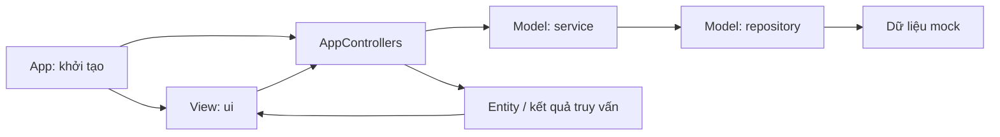

# Kiến trúc MVC của UniSchedule

## Kết quả rà soát

Trước đợt chỉnh sửa, dự án tổ chức theo các lớp UI / Service / Repository nhưng chưa có Controller độc lập. Panel và dialog trực tiếp gọi Service, lọc dữ liệu theo vai trò, tính thống kê, kiểm tra mật khẩu và thay đổi các entity dùng chung. Nhật ký demo cũng được tạo ngay trong View.

Hiện tại dự án dùng MVC cho ứng dụng Swing, với Service và Repository nằm trong phần Model mở rộng:

## Trách nhiệm các lớp

| Thành phần | Package | Trách nhiệm |
| --- | --- | --- |
| View | `ui.frame`, `ui.panel`, `ui.dialog`, `ui.component`, `ui.renderer` | Bố cục Swing, thu thập dữ liệu nhập, sự kiện nút, điều hướng màn hình, hiển thị kết quả và lỗi. |
| Controller | `controller` | Nhận yêu cầu từ View, chuẩn bị bản nháp, lọc dữ liệu, tính dữ liệu dashboard và gọi Service. Không phụ thuộc Swing. |
| Entity | `model` | User, CourseSection, ScheduleEntry, Classroom, ChangeRequest, AuditEntry và các kiểu nghiệp vụ. |
| Service | `service` | Kiểm tra nghiệp vụ và cập nhật dữ liệu: xung đột, quyền duyệt yêu cầu, mật khẩu, hồ sơ, số lượng thiết bị, phân công giảng viên. |
| Repository | `repository`, `repository.mock` | Truy xuất dữ liệu và triển khai lưu trữ trong bộ nhớ. CatalogService truy cập CatalogRepository thay vì MockDataStore trực tiếp. |
| Khởi tạo | `App`, `AppServices`, `AppControllers` | Tạo một bộ Model dùng chung, nối các Service với Controller và truyền Controller vào View. |

`ui.model.GenericTableModel` là adapter dữ liệu cho JTable, không phải tầng nghiệp vụ Model. `FormController` tạo entity nháp chưa lưu; `DashboardController.Metric` và `BuildingUsage` là dữ liệu kết quả không chứa màu AWT hay component Swing.

## Luồng thao tác

1. ActionListener trong View lấy giá trị các ô nhập và gọi Controller. View chỉ giữ trạng thái trình bày như tab, tuần đang xem, hàng được chọn.
2. Controller chuyển đổi dữ liệu form hoặc thực hiện truy vấn, rồi gọi Service cho thao tác nghiệp vụ.
3. Service kiểm tra hợp lệ trước khi sửa entity và ghi qua Repository.
4. View nhận kết quả hoặc ValidationException để tải lại bảng, đóng dialog hay hiển thị thông báo.

ActionListener, định dạng nhãn, chọn cell theo ngày/ca để vẽ lịch, và ẩn menu theo vai trò vẫn thuộc View. Các điều kiện lọc bản ghi, đếm thống kê và thay đổi entity không đặt trong View.

## Các sửa lỗi đi kèm

- Hồ sơ và số lượng thiết bị không còn bị sửa trước khi kiểm tra hợp lệ.
- Quy tắc đổi mật khẩu chuyển vào UserService và được gọi qua UserController.
- Form lịch không còn âm thầm thay giảng viên của lớp học phần. Giảng viên hiển thị theo lớp đã chọn; việc thay phân công thực hiện ở màn hình Lớp học phần.
- Bản nháp sửa tài khoản giữ mã giảng viên, khoa, mã sinh viên và lớp của tài khoản hiện có khi giữ nguyên vai trò.
- Nhật ký mock được quản lý bởi AuditService; bấm tải lại không tạo thời gian ngẫu nhiên mới.

## Kiểm thử

Chạy `mvn test` từ thư mục dự án.

- `MvcArchitectureTest`: chặn View phụ thuộc Service/Repository, tạo hoặc sửa entity trực tiếp; chặn Controller/Model phụ thuộc Swing và phụ thuộc ngược vào View.
- `ControllerTest`: kiểm tra lọc dữ liệu theo vai trò, đổi mật khẩu, cập nhật sai không làm thay đổi dữ liệu, bản nháp không tác động dữ liệu chung, giữ thông tin giảng viên và quyền duyệt yêu cầu.
- `DemoSmokeTest`, `UiRenderTest`: giữ các kiểm thử chức năng và ảnh render giao diện hiện có.

Đây vẫn là demo dữ liệu trong bộ nhớ. Nhật ký là dữ liệu minh họa, chưa có JDBC, transaction cơ sở dữ liệu hay lưu dữ liệu giữa các lần chạy. Việc ẩn menu trên Swing không thay thế kiểm soát quyền ở nghiệp vụ; các luồng duyệt yêu cầu hiện kiểm tra quyền trong RequestService.
